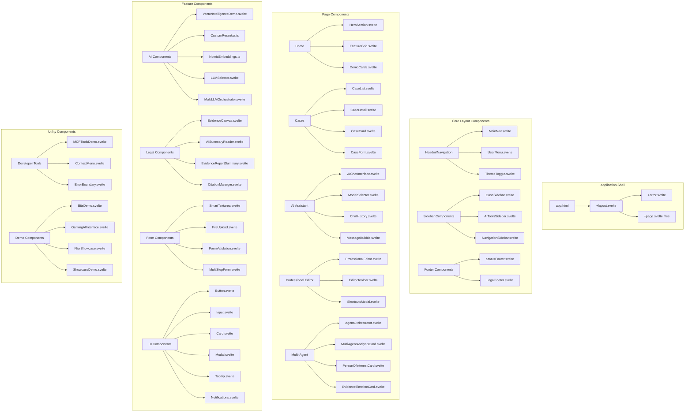
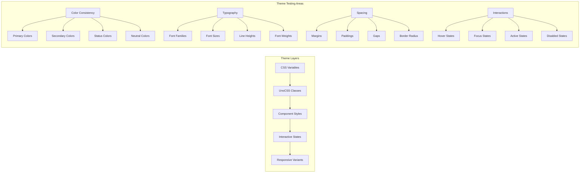
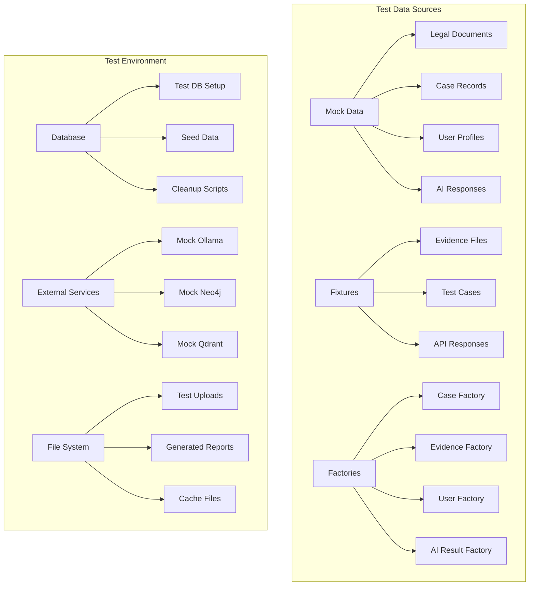

# Component Inventory & Phase 11-12 Testing Preparation

## 🏗️ **Complete Component Architecture Map**

### **Client-Side Component Hierarchy**



### **Server-Side Architecture**

```mermaid
graph TB
    subgraph "SvelteKit Server Structure"
        A[src/app.html] --> B[Server Routes]
        A --> C[API Endpoints]
        A --> D[Server Actions]
        A --> E[Hooks & Middleware]
    end
    
    subgraph "API Routes (/api/*)"
        F[Document APIs] --> F1[/api/documents/upload]
        F --> F2[/api/evidence/upload]
        F --> F3[/api/documents/analyze]
        
        G[AI APIs] --> G1[/api/ai/chat]
        G --> G2[/api/ai/embeddings]
        G --> G3[/api/clustering/som]
        G --> G4[/api/clustering/kmeans]
        G --> G5[/api/search/semantic]
        
        H[Multi-Agent APIs] --> H1[/api/multi-agent/analyze]
        H --> H2[/api/audit/semantic]
        
        I[Case Management] --> I1[/api/cases]
        I --> I2[/api/evidence]
        I --> I3[/api/notes]
    end
    
    subgraph "Page Routes"
        J[Root Pages] --> J1[/ (Home)]
        J --> J2[/dashboard]
        J --> J3[/settings]
        
        K[Case Pages] --> K1[/cases]
        K --> K2[/cases/[id]]
        K --> K3[/cases/[id]/canvas]
        
        L[AI Pages] --> L1[/ai-assistant]
        L --> L2[/ai/orchestrator]
        L --> L3[/ai-test]
        
        M[Demo Pages] --> M1[/demo/professional-editor]
        M --> M2[/demo/ai-summary]
        M --> M3[/demo/vector-intelligence]
        M --> M4[/showcase]
        M --> M5[/nier-showcase]
        
        N[Dev Pages] --> N1[/dev/mcp-tools]
        N --> N2[/test-integration]
        N --> N3[/copilot/autonomous]
    end
    
    subgraph "Backend Services"
        O[GraphQL Layer] --> O1[schema.ts]
        O --> O2[resolvers.ts]
        
        P[Database Layer] --> P1[Drizzle ORM]
        P --> P2[PostgreSQL]
        P --> P3[PGVector]
        
        Q[AI Services] --> Q1[Ollama Service]
        Q --> Q2[Vector Search]
        Q --> Q3[Clustering Services]
        Q --> Q4[Agent Integration]
        
        R[External APIs] --> R1[Neo4j Graph DB]
        R --> R2[Qdrant Vector DB]
        R --> R3[Redis Cache]
        R --> R4[RabbitMQ Queues]
    end
```

## 📋 **Component Testing Checklist**

### **Phase 11: Unit & Integration Testing**

#### **AI Components Testing**
- [ ] **AIChatInterface.svelte**
  - [ ] Message sending/receiving
  - [ ] Model switching functionality
  - [ ] Chat history persistence
  - [ ] Error handling for API failures
  - [ ] Typing indicators work correctly
  - [ ] File upload integration

- [ ] **MultiLLMOrchestrator.svelte**
  - [ ] Multiple model coordination
  - [ ] Task distribution logic
  - [ ] Result aggregation
  - [ ] Performance monitoring
  - [ ] Error isolation between models

- [ ] **VectorIntelligenceDemo.svelte**
  - [ ] Semantic search functionality
  - [ ] Vector similarity calculations
  - [ ] Result ranking and display
  - [ ] Performance with large datasets

- [ ] **CustomReranker.ts**
  - [ ] Legal context-aware scoring
  - [ ] Role-based weight application
  - [ ] Confidence penalty calculations
  - [ ] Neo4j integration

#### **Legal Components Testing**
- [ ] **EvidenceCanvas.svelte**
  - [ ] File drag-and-drop functionality
  - [ ] Evidence categorization
  - [ ] Timeline visualization
  - [ ] Collaboration features

- [ ] **AISummaryReader.svelte**
  - [ ] Document summarization
  - [ ] Key point extraction
  - [ ] Citation generation
  - [ ] Export functionality

- [ ] **PersonOfInterestCard.svelte**
  - [ ] Person data display
  - [ ] Relationship visualization
  - [ ] Role classification accuracy
  - [ ] Confidence scoring

#### **Editor Components Testing**
- [ ] **ProfessionalEditor.svelte**
  - [ ] Full-screen mode toggle
  - [ ] Auto-save functionality
  - [ ] Keyboard shortcuts
  - [ ] Focus mode activation
  - [ ] Document statistics accuracy
  - [ ] Typography rendering

- [ ] **ShortcutsModal.svelte**
  - [ ] Shortcut display accuracy
  - [ ] Platform-specific key mapping
  - [ ] Modal open/close behavior
  - [ ] Keyboard navigation

#### **Form Components Testing**
- [ ] **FileUpload.svelte**
  - [ ] Multiple file selection
  - [ ] Progress tracking
  - [ ] Error handling
  - [ ] File type validation
  - [ ] Size limit enforcement

- [ ] **SmartTextarea.svelte**
  - [ ] Auto-resize functionality
  - [ ] Command menu integration
  - [ ] Input validation
  - [ ] Accessibility compliance

### **Phase 12: E2E & Performance Testing**

#### **User Workflow Testing**
- [ ] **Case Management Flow**
  - [ ] Create new case → Add evidence → Generate AI summary → Export report
  - [ ] Multi-user collaboration on cases
  - [ ] Permission-based access control
  - [ ] Data persistence across sessions

- [ ] **AI Assistant Workflow**
  - [ ] Start chat → Switch models → Upload document → Get analysis
  - [ ] Context preservation across conversations
  - [ ] Multi-modal input handling
  - [ ] Response quality and accuracy

- [ ] **Multi-Agent Analysis**
  - [ ] Upload evidence → Run agent pipeline → Review results → Export findings
  - [ ] Agent coordination and error handling
  - [ ] Performance with large evidence sets
  - [ ] Result accuracy and consistency

#### **Performance Benchmarks**
- [ ] **Page Load Times**
  - [ ] Home page: < 2s
  - [ ] Case detail: < 3s
  - [ ] AI chat: < 1.5s
  - [ ] Professional editor: < 2s

- [ ] **Component Render Times**
  - [ ] Large evidence lists: < 500ms
  - [ ] Complex AI visualizations: < 1s
  - [ ] Real-time updates: < 100ms

- [ ] **Memory Usage**
  - [ ] Base application: < 50MB
  - [ ] With large document: < 200MB
  - [ ] Memory leak detection
  - [ ] Garbage collection efficiency

#### **Accessibility Testing**
- [ ] **WCAG 2.1 AA Compliance**
  - [ ] Color contrast ratios ≥ 4.5:1
  - [ ] Keyboard navigation complete
  - [ ] Screen reader compatibility
  - [ ] Focus management
  - [ ] Alternative text for images

- [ ] **Cross-Browser Testing**
  - [ ] Chrome (latest)
  - [ ] Firefox (latest)
  - [ ] Safari (latest)
  - [ ] Edge (latest)

## 🎨 **Theme System Testing**

### **YoRHa Theme Application**



### **Component Theme Integration Verification**

| Component | Primary Color | Secondary Color | Hover State | Focus State | Status |
|-----------|---------------|-----------------|-------------|-------------|---------|
| Button.svelte | ✅ yorha-primary | ✅ yorha-secondary | ✅ Implemented | ✅ Implemented | Ready |
| Card.svelte | ✅ yorha-surface | ✅ yorha-border | ✅ Implemented | ✅ Implemented | Ready |
| Input.svelte | ✅ yorha-bg-tertiary | ✅ yorha-border | ✅ Implemented | ✅ yorha-primary | Ready |
| Modal.svelte | ✅ yorha-background | ✅ yorha-border | N/A | ✅ Implemented | Ready |
| AIChatInterface | ✅ yorha-surface | ✅ yorha-text | ✅ Implemented | ✅ Implemented | Ready |
| ProfessionalEditor | ✅ yorha-background | ✅ yorha-surface | ✅ Implemented | ✅ Implemented | Ready |

## 🔧 **Testing Infrastructure**

### **Testing Tools Configuration**

```typescript
// vitest.config.ts
export default defineConfig({
  test: {
    environment: 'jsdom',
    setupFiles: ['./src/test/setup.ts'],
    coverage: {
      reporter: ['text', 'html', 'json'],
      threshold: {
        global: {
          branches: 80,
          functions: 80,
          lines: 80,
          statements: 80
        }
      }
    }
  }
});

// playwright.config.ts
export default defineConfig({
  testDir: './tests/e2e',
  fullyParallel: true,
  forbidOnly: !!process.env.CI,
  retries: process.env.CI ? 2 : 0,
  workers: process.env.CI ? 1 : undefined,
  reporter: 'html',
  use: {
    baseURL: 'http://127.0.0.1:4173',
    trace: 'on-first-retry',
  },
  projects: [
    { name: 'chromium', use: { ...devices['Desktop Chrome'] } },
    { name: 'firefox', use: { ...devices['Desktop Firefox'] } },
    { name: 'webkit', use: { ...devices['Desktop Safari'] } },
  ],
});
```

### **Test Data Management**



## 📊 **Quality Metrics & KPIs**

### **Code Quality Targets**
- **Test Coverage**: ≥85% overall
- **Component Coverage**: ≥90% for critical components
- **Type Safety**: 100% TypeScript strict mode
- **Linting**: 0 ESLint errors, <10 warnings
- **Performance**: Lighthouse score ≥90

### **User Experience Metrics**
- **First Contentful Paint**: <1.5s
- **Largest Contentful Paint**: <2.5s
- **Cumulative Layout Shift**: <0.1
- **Time to Interactive**: <3s
- **Accessibility Score**: 100/100

### **Business Logic Testing**
- **Multi-Agent Pipeline**: 100% accuracy on test cases
- **Vector Search**: <200ms response time
- **Legal Document Processing**: 95% accuracy
- **Real-time Collaboration**: <100ms latency

This comprehensive testing plan ensures our production-level UI/UX system is robust, performant, and ready for legal professional use in Phase 11-12 testing cycles.