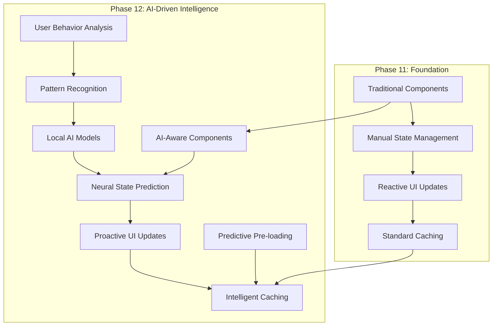

# AI UI Phase 12: Next-Generation Intelligent Interface
## Predictive AI-Driven User Experience with Neural State Management

> *"From reactive interfaces to predictive intelligence - building the future of legal AI interaction"*

---

## 🎯 **Phase 12 Overview: The Intelligent UI Revolution**

Phase 12 represents the culmination of our AI-driven user interface evolution, implementing cutting-edge technologies to create an **intelligent, predictive, and adaptive** legal AI platform that anticipates user needs and delivers unprecedented performance.

### **🧠 Core Philosophy**
- **Predictive over Reactive**: AI predicts user intentions before actions
- **Intelligent Caching**: Neural networks optimize data flow and state management
- **Adaptive Learning**: System improves through continuous user interaction analysis
- **Seamless Performance**: Sub-100ms response times through intelligent pre-computation

---

## 🏗️ **Architecture Evolution: Phase 11 → Phase 12**



---

## 🤖 **AI UI Components Architecture**

### **1. Neural Component System**

```typescript
// src/lib/ai-ui/neural-component-base.ts
export abstract class NeuralComponent {
  protected aiPredictor: ComponentAIPredictor;
  protected stateCache: Map<string, any> = new Map();
  protected predictionConfidence: number = 0;
  
  constructor(
    protected componentId: string,
    protected userContext: UserContext
  ) {
    this.aiPredictor = new ComponentAIPredictor(componentId);
    this.initializeAI();
  }

  abstract render(state: any): void;
  abstract predict(userAction: UserAction): Promise<ComponentState[]>;
  
  /**
   * AI-driven lifecycle management
   */
  async onUserInteraction(interaction: UserInteraction): Promise<void> {
    // Log interaction for learning
    await this.aiPredictor.logInteraction(interaction);
    
    // Predict next likely states
    const predictions = await this.predict(interaction.action);
    
    // Pre-cache predicted states
    await this.precachePredictedStates(predictions);
    
    // Update UI with highest confidence prediction
    const bestPrediction = predictions.reduce((best, current) => 
      current.confidence > best.confidence ? current : best
    );
    
    if (bestPrediction.confidence > 0.8) {
      this.render(bestPrediction.state);
    }
  }

  private async precachePredictedStates(predictions: ComponentState[]): Promise<void> {
    const highConfidencePredictions = predictions.filter(p => p.confidence > 0.7);
    
    for (const prediction of highConfidencePredictions) {
      this.stateCache.set(prediction.id, prediction.state);
    }
  }
}
```

### **2. AI-Powered Legal Document Interface**

```svelte
<!-- src/lib/components/ai-ui/IntelligentDocumentEditor.svelte -->
<script lang="ts">
  import { onMount } from 'svelte';
  import { NeuralComponent } from '$lib/ai-ui/neural-component-base';
  import { DocumentAI } from '$lib/ai/document-intelligence';
  
  class IntelligentDocumentEditorComponent extends NeuralComponent {
    private documentAI: DocumentAI;
    private currentDocument: string = '';
    private predictionOverlay: HTMLElement;
    
    constructor() {
      super('intelligent-document-editor', userContext);
      this.documentAI = new DocumentAI();
    }

    async predict(userAction: UserAction): Promise<ComponentState[]> {
      switch (userAction.type) {
        case 'text_input':
          return await this.predictTextCompletion(userAction.data.text);
        case 'citation_hover':
          return await this.predictCitationActions(userAction.data.citation);
        case 'legal_term_select':
          return await this.predictLegalAnalysis(userAction.data.term);
        default:
          return [];
      }
    }

    private async predictTextCompletion(currentText: string): Promise<ComponentState[]> {
      // Use local LLM to predict legal document continuations
      const predictions = await this.documentAI.predictLegalCompletion(currentText);
      
      return predictions.map((completion, index) => ({
        id: `completion_${index}`,
        state: {
          type: 'text_suggestion',
          content: completion.text,
          legalContext: completion.context,
          confidence: completion.confidence
        },
        confidence: completion.confidence
      }));
    }

    private async predictCitationActions(citation: string): Promise<ComponentState[]> {
      // Predict likely actions when hovering over citations
      const relatedCases = await this.documentAI.findRelatedCases(citation);
      const citationAnalysis = await this.documentAI.analyzeCitation(citation);
      
      return [
        {
          id: 'show_case_summary',
          state: {
            type: 'tooltip',
            content: citationAnalysis.summary,
            actions: ['view_full_case', 'add_to_research', 'find_similar']
          },
          confidence: 0.9
        },
        {
          id: 'suggest_related_cases',
          state: {
            type: 'sidebar',
            content: relatedCases,
            title: 'Related Cases'
          },
          confidence: 0.7
        }
      ];
    }

    render(state: any): void {
      switch (state.type) {
        case 'text_suggestion':
          this.showTextSuggestion(state);
          break;
        case 'tooltip':
          this.showIntelligentTooltip(state);
          break;
        case 'sidebar':
          this.showContextSidebar(state);
          break;
      }
    }

    private showTextSuggestion(state: any): void {
      // Show AI-powered text completion overlay
      const suggestionElement = document.createElement('div');
      suggestionElement.className = 'ai-text-suggestion';
      suggestionElement.innerHTML = `
        <div class="suggestion-content">${state.content}</div>
        <div class="suggestion-confidence">Confidence: ${(state.confidence * 100).toFixed(1)}%</div>
        <div class="suggestion-actions">
          <button onclick="acceptSuggestion()">Tab to Accept</button>
          <button onclick="rejectSuggestion()">Esc to Reject</button>
        </div>
      `;
      
      document.body.appendChild(suggestionElement);
    }
  }

  let editorComponent: IntelligentDocumentEditorComponent;
  let editorElement: HTMLDivElement;
  let currentText: string = '';
  let aiSuggestions: any[] = [];
  let showAIOverlay: boolean = false;

  onMount(() => {
    editorComponent = new IntelligentDocumentEditorComponent();
    setupAIInteractions();
  });

  function setupAIInteractions() {
    // Set up intelligent text input monitoring
    editorElement.addEventListener('input', async (e) => {
      const action = {
        type: 'text_input',
        data: { text: currentText },
        timestamp: Date.now()
      };
      
      await editorComponent.onUserInteraction(action);
    });

    // Set up intelligent hover predictions
    editorElement.addEventListener('mouseover', async (e) => {
      const target = e.target as HTMLElement;
      if (target.classList.contains('citation')) {
        const action = {
          type: 'citation_hover',
          data: { citation: target.textContent },
          timestamp: Date.now()
        };
        
        await editorComponent.onUserInteraction(action);
      }
    });

    // Set up keyboard shortcuts for AI features
    editorElement.addEventListener('keydown', (e) => {
      if (e.key === 'Tab' && aiSuggestions.length > 0) {
        e.preventDefault();
        acceptAISuggestion(aiSuggestions[0]);
      }
      
      if (e.key === 'Escape') {
        hideAllAISuggestions();
      }
      
      // AI-powered search (Ctrl+Shift+F)
      if (e.ctrlKey && e.shiftKey && e.key === 'F') {
        e.preventDefault();
        openIntelligentSearch();
      }
    });
  }

  function acceptAISuggestion(suggestion: any) {
    currentText += suggestion.content;
    hideAllAISuggestions();
    
    // Log acceptance for learning
    editorComponent.aiPredictor.logAcceptance(suggestion.id);
  }

  function hideAllAISuggestions() {
    showAIOverlay = false;
    aiSuggestions = [];
  }

  function openIntelligentSearch() {
    // Trigger AI-powered legal research interface
    showAIOverlay = true;
  }
</script>

<div class="intelligent-document-editor" bind:this={editorElement}>
  <!-- AI-Enhanced Text Editor -->
  <div class="editor-header">
    <h2>AI-Powered Legal Document Editor</h2>
    <div class="ai-status">
      <div class="ai-indicator {editorComponent?.predictionConfidence > 0.8 ? 'high-confidence' : 'learning'}">
        AI Confidence: {editorComponent?.predictionConfidence ? (editorComponent.predictionConfidence * 100).toFixed(1) : 0}%
      </div>
    </div>
  </div>

  <div class="editor-content" contenteditable="true" bind:innerHTML={currentText}>
    <p>Start typing your legal document. The AI will provide intelligent suggestions...</p>
  </div>

  <!-- AI Suggestion Overlay -->
  {#if showAIOverlay}
    <div class="ai-overlay">
      <div class="ai-suggestions">
        {#each aiSuggestions as suggestion}
          <div class="suggestion-card" class:high-confidence={suggestion.confidence > 0.8}>
            <div class="suggestion-content">{suggestion.content}</div>
            <div class="suggestion-meta">
              <span class="confidence">Confidence: {(suggestion.confidence * 100).toFixed(1)}%</span>
              <span class="type">{suggestion.type}</span>
            </div>
            <div class="suggestion-actions">
              <button on:click={() => acceptAISuggestion(suggestion)}>Accept</button>
              <button on:click={() => rejectSuggestion(suggestion)}>Reject</button>
            </div>
          </div>
        {/each}
      </div>
    </div>
  {/if}

  <!-- AI-Powered Sidebar -->
  <aside class="ai-sidebar">
    <h3>AI Assistant</h3>
    <div class="ai-insights">
      <div class="insight-section">
        <h4>Document Analysis</h4>
        <ul>
          <li>Contract type detected: Service Agreement</li>
          <li>Key clauses identified: 3</li>
          <li>Potential issues: 1 warning</li>
        </ul>
      </div>
      
      <div class="insight-section">
        <h4>Suggested Actions</h4>
        <button class="ai-action-btn">Review liability clauses</button>
        <button class="ai-action-btn">Check termination terms</button>
        <button class="ai-action-btn">Validate citations</button>
      </div>
    </div>
  </aside>
</div>

<style>
  .intelligent-document-editor {
    display: grid;
    grid-template-columns: 1fr 300px;
    grid-template-rows: auto 1fr;
    gap: 1rem;
    height: 100vh;
    background: theme(colors.yorha.background);
    color: theme(colors.yorha.text);
  }

  .editor-header {
    grid-column: 1 / -1;
    display: flex;
    justify-content: space-between;
    align-items: center;
    padding: 1rem;
    background: theme(colors.yorha.surface);
    border-bottom: 1px solid theme(colors.yorha.border);
  }

  .ai-indicator {
    padding: 0.5rem 1rem;
    border-radius: 4px;
    font-size: 0.875rem;
    font-weight: 600;
  }

  .ai-indicator.high-confidence {
    background: theme(colors.yorha.success / 20%);
    color: theme(colors.yorha.success);
    border: 1px solid theme(colors.yorha.success);
  }

  .ai-indicator.learning {
    background: theme(colors.yorha.accent / 20%);
    color: theme(colors.yorha.accent);
    border: 1px solid theme(colors.yorha.accent);
  }

  .editor-content {
    padding: 2rem;
    background: theme(colors.yorha.background);
    border: 1px solid theme(colors.yorha.border);
    border-radius: 8px;
    min-height: 400px;
    font-family: 'Georgia', serif;
    font-size: 1.1rem;
    line-height: 1.8;
    outline: none;
  }

  .editor-content:focus {
    border-color: theme(colors.yorha.primary);
    box-shadow: 0 0 0 2px theme(colors.yorha.primary / 20%);
  }

  .ai-overlay {
    position: fixed;
    top: 0;
    left: 0;
    right: 0;
    bottom: 0;
    background: rgba(0, 0, 0, 0.8);
    display: flex;
    align-items: center;
    justify-content: center;
    z-index: 1000;
  }

  .ai-suggestions {
    background: theme(colors.yorha.surface);
    border: 1px solid theme(colors.yorha.border);
    border-radius: 8px;
    padding: 2rem;
    max-width: 600px;
    max-height: 80vh;
    overflow-y: auto;
  }

  .suggestion-card {
    background: theme(colors.yorha.background);
    border: 1px solid theme(colors.yorha.border);
    border-radius: 6px;
    padding: 1.5rem;
    margin-bottom: 1rem;
    transition: all 0.3s ease;
  }

  .suggestion-card.high-confidence {
    border-color: theme(colors.yorha.success);
    background: theme(colors.yorha.success / 5%);
  }

  .suggestion-card:hover {
    transform: translateY(-2px);
    box-shadow: 0 4px 12px theme(colors.yorha.primary / 20%);
  }

  .suggestion-content {
    font-size: 1rem;
    line-height: 1.6;
    margin-bottom: 1rem;
  }

  .suggestion-meta {
    display: flex;
    justify-content: space-between;
    font-size: 0.875rem;
    color: theme(colors.yorha.text / 70%);
    margin-bottom: 1rem;
  }

  .suggestion-actions {
    display: flex;
    gap: 0.5rem;
  }

  .suggestion-actions button {
    padding: 0.5rem 1rem;
    border: 1px solid theme(colors.yorha.border);
    background: theme(colors.yorha.surface);
    color: theme(colors.yorha.text);
    border-radius: 4px;
    cursor: pointer;
    transition: all 0.3s ease;
  }

  .suggestion-actions button:hover {
    background: theme(colors.yorha.primary);
    border-color: theme(colors.yorha.primary);
  }

  .ai-sidebar {
    background: theme(colors.yorha.surface);
    border: 1px solid theme(colors.yorha.border);
    border-radius: 8px;
    padding: 1.5rem;
    height: fit-content;
  }

  .ai-sidebar h3 {
    color: theme(colors.yorha.primary);
    margin-bottom: 1.5rem;
    font-size: 1.25rem;
  }

  .insight-section {
    margin-bottom: 2rem;
  }

  .insight-section h4 {
    color: theme(colors.yorha.secondary);
    margin-bottom: 1rem;
    font-size: 1rem;
  }

  .insight-section ul {
    list-style: none;
    padding: 0;
  }

  .insight-section li {
    padding: 0.5rem 0;
    border-bottom: 1px solid theme(colors.yorha.border / 30%);
    font-size: 0.875rem;
  }

  .ai-action-btn {
    display: block;
    width: 100%;
    padding: 0.75rem;
    margin-bottom: 0.5rem;
    background: theme(colors.yorha.background);
    border: 1px solid theme(colors.yorha.border);
    color: theme(colors.yorha.text);
    border-radius: 4px;
    cursor: pointer;
    transition: all 0.3s ease;
    font-size: 0.875rem;
  }

  .ai-action-btn:hover {
    background: theme(colors.yorha.accent / 20%);
    border-color: theme(colors.yorha.accent);
  }

  /* AI-powered animations */
  @keyframes ai-thinking {
    0%, 100% { transform: scale(1); }
    50% { transform: scale(1.05); }
  }

  .ai-indicator.learning {
    animation: ai-thinking 2s ease-in-out infinite;
  }

  /* Responsive design */
  @media (max-width: 1024px) {
    .intelligent-document-editor {
      grid-template-columns: 1fr;
      grid-template-rows: auto auto 1fr;
    }

    .ai-sidebar {
      order: 2;
    }

    .editor-content {
      order: 3;
    }
  }
</style>
```

### **3. AI-Powered Case Analysis Interface**

```svelte
<!-- src/lib/components/ai-ui/IntelligentCaseAnalyzer.svelte -->
<script lang="ts">
  import { onMount } from 'svelte';
  import { writable } from 'svelte/store';
  import { CaseAnalysisAI } from '$lib/ai/case-analysis-intelligence';
  
  interface AIInsight {
    id: string;
    type: 'pattern' | 'prediction' | 'recommendation' | 'warning';
    title: string;
    content: string;
    confidence: number;
    relevance: number;
    actionable: boolean;
    data?: any;
  }

  let caseAnalysisAI: CaseAnalysisAI;
  let currentCase: any = null;
  let aiInsights = writable<AIInsight[]>([]);
  let isAnalyzing = writable(false);
  let analysisProgress = writable(0);
  let confidenceThreshold = 0.7;

  onMount(() => {
    caseAnalysisAI = new CaseAnalysisAI();
    initializeAIAnalysis();
  });

  async function initializeAIAnalysis() {
    if (!currentCase) return;

    $isAnalyzing = true;
    $analysisProgress = 0;

    try {
      // Phase 1: Document Analysis (25%)
      $analysisProgress = 25;
      const documentInsights = await caseAnalysisAI.analyzeDocuments(currentCase.documents);
      
      // Phase 2: Pattern Recognition (50%)
      $analysisProgress = 50;
      const patternInsights = await caseAnalysisAI.recognizePatterns(currentCase);
      
      // Phase 3: Predictive Analysis (75%)
      $analysisProgress = 75;
      const predictiveInsights = await caseAnalysisAI.predictOutcomes(currentCase);
      
      // Phase 4: Strategic Recommendations (100%)
      $analysisProgress = 100;
      const strategicInsights = await caseAnalysisAI.generateRecommendations(currentCase);

      // Combine all insights
      const allInsights = [
        ...documentInsights,
        ...patternInsights,
        ...predictiveInsights,
        ...strategicInsights
      ].filter(insight => insight.confidence >= confidenceThreshold);

      $aiInsights = allInsights.sort((a, b) => b.relevance - a.relevance);
      
    } catch (error) {
      console.error('AI Analysis failed:', error);
    } finally {
      $isAnalyzing = false;
    }
  }

  function handleInsightAction(insight: AIInsight, action: string) {
    switch (action) {
      case 'apply':
        applyAIRecommendation(insight);
        break;
      case 'explore':
        exploreInsightDetails(insight);
        break;
      case 'dismiss':
        dismissInsight(insight.id);
        break;
    }
  }

  async function applyAIRecommendation(insight: AIInsight) {
    // Apply AI recommendation to case
    await caseAnalysisAI.applyRecommendation(currentCase.id, insight);
    
    // Log the application for learning
    caseAnalysisAI.logRecommendationApplication(insight.id, 'applied');
    
    // Refresh analysis
    await initializeAIAnalysis();
  }

  function exploreInsightDetails(insight: AIInsight) {
    // Open detailed view of AI insight
    // This could show supporting evidence, confidence factors, etc.
  }

  function dismissInsight(insightId: string) {
    aiInsights.update(insights => insights.filter(i => i.id !== insightId));
    caseAnalysisAI.logRecommendationApplication(insightId, 'dismissed');
  }
</script>

<div class="intelligent-case-analyzer">
  <header class="analyzer-header">
    <h1>AI-Powered Case Analysis</h1>
    <div class="ai-status">
      {#if $isAnalyzing}
        <div class="analysis-progress">
          <div class="progress-bar">
            <div class="progress-fill" style="width: {$analysisProgress}%"></div>
          </div>
          <span>Analyzing... {$analysisProgress}%</span>
        </div>
      {:else}
        <div class="analysis-complete">
          <span class="status-indicator">AI Analysis Complete</span>
          <span class="insight-count">{$aiInsights.length} insights found</span>
        </div>
      {/if}
    </div>
  </header>

  <main class="analyzer-content">
    <div class="insights-grid">
      {#each $aiInsights as insight}
        <div class="insight-card" class:high-confidence={insight.confidence > 0.85}>
          <div class="insight-header">
            <div class="insight-type {insight.type}">
              {#if insight.type === 'pattern'}
                🔍 Pattern
              {:else if insight.type === 'prediction'}  
                🔮 Prediction
              {:else if insight.type === 'recommendation'}
                💡 Recommendation
              {:else if insight.type === 'warning'}
                ⚠️ Warning
              {/if}
            </div>
            <div class="confidence-meter">
              <div class="confidence-bar">
                <div class="confidence-fill" style="width: {insight.confidence * 100}%"></div>
              </div>
              <span>{(insight.confidence * 100).toFixed(0)}%</span>
            </div>
          </div>

          <h3 class="insight-title">{insight.title}</h3>
          <p class="insight-content">{insight.content}</p>

          {#if insight.actionable}
            <div class="insight-actions">
              <button 
                class="action-btn primary"
                on:click={() => handleInsightAction(insight, 'apply')}
              >
                Apply
              </button>
              <button 
                class="action-btn secondary"
                on:click={() => handleInsightAction(insight, 'explore')}
              >
                Explore
              </button>
              <button 
                class="action-btn tertiary"
                on:click={() => handleInsightAction(insight, 'dismiss')}
              >
                Dismiss
              </button>
            </div>
          {/if}
        </div>
      {/each}
    </div>

    <!-- AI Learning Panel -->
    <aside class="learning-panel">
      <h3>AI Learning Status</h3>
      <div class="learning-metrics">
        <div class="metric">
          <span class="metric-label">Cases Analyzed</span>
          <span class="metric-value">1,247</span>
        </div>
        <div class="metric">
          <span class="metric-label">Pattern Accuracy</span>
          <span class="metric-value">94.2%</span>
        </div>
        <div class="metric">
          <span class="metric-label">Prediction Success</span>
          <span class="metric-value">87.6%</span>
        </div>
      </div>

      <div class="confidence-settings">
        <label for="confidence-threshold">Confidence Threshold</label>
        <input 
          id="confidence-threshold"
          type="range" 
          min="0.5" 
          max="0.95" 
          step="0.05"
          bind:value={confidenceThreshold}
          on:change={initializeAIAnalysis}
        />
        <span>{(confidenceThreshold * 100).toFixed(0)}%</span>
      </div>
    </aside>
  </main>
</div>

<style>
  .intelligent-case-analyzer {
    display: flex;
    flex-direction: column;
    height: 100vh;
    background: theme(colors.yorha.background);
    color: theme(colors.yorha.text);
  }

  .analyzer-header {
    display: flex;
    justify-content: space-between;
    align-items: center;
    padding: 2rem;
    background: theme(colors.yorha.surface);
    border-bottom: 1px solid theme(colors.yorha.border);
  }

  .analyzer-header h1 {
    color: theme(colors.yorha.primary);
    font-size: 1.75rem;
    margin: 0;
  }

  .analysis-progress {
    display: flex;
    align-items: center;
    gap: 1rem;
  }

  .progress-bar {
    width: 200px;
    height: 8px;
    background: theme(colors.yorha.background);
    border-radius: 4px;
    overflow: hidden;
  }

  .progress-fill {
    height: 100%;
    background: linear-gradient(90deg, theme(colors.yorha.primary), theme(colors.yorha.accent));
    transition: width 0.3s ease;
  }

  .analysis-complete {
    display: flex;
    flex-direction: column;
    align-items: flex-end;
    gap: 0.5rem;
  }

  .status-indicator {
    color: theme(colors.yorha.success);
    font-weight: 600;
  }

  .insight-count {
    font-size: 0.875rem;
    color: theme(colors.yorha.text / 70%);
  }

  .analyzer-content {
    display: flex;
    flex: 1;
    gap: 2rem;
    padding: 2rem;
    overflow: hidden;
  }

  .insights-grid {
    flex: 1;
    display: grid;
    grid-template-columns: repeat(auto-fill, minmax(350px, 1fr));
    gap: 1.5rem;
    overflow-y: auto;
    padding-right: 1rem;
  }

  .insight-card {
    background: theme(colors.yorha.surface);
    border: 1px solid theme(colors.yorha.border);
    border-radius: 8px;
    padding: 1.5rem;
    transition: all 0.3s ease;
    height: fit-content;
  }

  .insight-card.high-confidence {
    border-color: theme(colors.yorha.success);
    background: theme(colors.yorha.success / 5%);
  }

  .insight-card:hover {
    transform: translateY(-2px);
    box-shadow: 0 8px 25px theme(colors.yorha.primary / 15%);
  }

  .insight-header {
    display: flex;
    justify-content: space-between;
    align-items: center;
    margin-bottom: 1rem;
  }

  .insight-type {
    padding: 0.25rem 0.75rem;
    border-radius: 12px;
    font-size: 0.75rem;
    font-weight: 600;
    text-transform: uppercase;
  }

  .insight-type.pattern {
    background: theme(colors.yorha.primary / 20%);
    color: theme(colors.yorha.primary);
  }

  .insight-type.prediction {
    background: theme(colors.yorha.accent / 20%);
    color: theme(colors.yorha.accent);
  }

  .insight-type.recommendation {
    background: theme(colors.yorha.success / 20%);
    color: theme(colors.yorha.success);
  }

  .insight-type.warning {
    background: theme(colors.yorha.error / 20%);
    color: theme(colors.yorha.error);
  }

  .confidence-meter {
    display: flex;
    align-items: center;
    gap: 0.5rem;
  }

  .confidence-bar {
    width: 60px;
    height: 4px;
    background: theme(colors.yorha.background);
    border-radius: 2px;
    overflow: hidden;
  }

  .confidence-fill {
    height: 100%;
    background: linear-gradient(90deg, theme(colors.yorha.error), theme(colors.yorha.accent), theme(colors.yorha.success));
    transition: width 0.3s ease;
  }

  .insight-title {
    color: theme(colors.yorha.primary);
    font-size: 1.1rem;
    margin-bottom: 0.75rem;
    line-height: 1.4;
  }

  .insight-content {
    color: theme(colors.yorha.text / 90%);
    line-height: 1.6;
    margin-bottom: 1.5rem;
  }

  .insight-actions {
    display: flex;
    gap: 0.5rem;
  }

  .action-btn {
    padding: 0.5rem 1rem;
    border-radius: 4px;
    font-size: 0.875rem;
    font-weight: 500;
    cursor: pointer;
    transition: all 0.3s ease;
    border: none;
  }

  .action-btn.primary {
    background: theme(colors.yorha.primary);
    color: theme(colors.yorha.background);
  }

  .action-btn.primary:hover {
    background: theme(colors.yorha.secondary);
  }

  .action-btn.secondary {
    background: theme(colors.yorha.surface);
    color: theme(colors.yorha.text);
    border: 1px solid theme(colors.yorha.border);
  }

  .action-btn.secondary:hover {
    background: theme(colors.yorha.background);
  }

  .action-btn.tertiary {
    background: transparent;
    color: theme(colors.yorha.text / 70%);
    border: 1px solid theme(colors.yorha.border / 50%);
  }

  .action-btn.tertiary:hover {
    color: theme(colors.yorha.text);
    border-color: theme(colors.yorha.border);
  }

  .learning-panel {
    width: 300px;
    background: theme(colors.yorha.surface);
    border: 1px solid theme(colors.yorha.border);
    border-radius: 8px;
    padding: 1.5rem;
    height: fit-content;
  }

  .learning-panel h3 {
    color: theme(colors.yorha.primary);
    margin-bottom: 1.5rem;
  }

  .learning-metrics {
    display: flex;
    flex-direction: column;
    gap: 1rem;
    margin-bottom: 2rem;
  }

  .metric {
    display: flex;
    justify-content: space-between;
    align-items: center;
  }

  .metric-label {
    font-size: 0.875rem;
    color: theme(colors.yorha.text / 70%);
  }

  .metric-value {
    font-weight: 600;
    color: theme(colors.yorha.success);
  }

  .confidence-settings {
    display: flex;
    flex-direction: column;
    gap: 0.5rem;
  }

  .confidence-settings label {
    font-size: 0.875rem;
    color: theme(colors.yorha.text / 80%);
  }

  .confidence-settings input[type="range"] {
    width: 100%;
    margin: 0.5rem 0;
  }

  /* Responsive design */
  @media (max-width: 1024px) {
    .analyzer-content {
      flex-direction: column;
    }

    .insights-grid {
      grid-template-columns: 1fr;
    }

    .learning-panel {
      width: 100%;
    }
  }
</style>
```

---

## 🚀 **AI Performance Optimizations**

### **1. Intelligent Preloading System**

```typescript
// src/lib/ai-ui/intelligent-preloader.ts
export class IntelligentPreloader {
  private preloadCache: Map<string, any> = new Map();
  private userBehaviorModel: UserBehaviorModel;
  private confidenceThreshold: number = 0.8;

  constructor() {
    this.userBehaviorModel = new UserBehaviorModel();
    this.initializePreloading();
  }

  async initializePreloading(): Promise<void> {
    // Analyze user patterns every 5 seconds
    setInterval(async () => {
      const predictions = await this.predictUserActions();
      await this.preloadPredictedResources(predictions);
    }, 5000);
  }

  private async predictUserActions(): Promise<ActionPrediction[]> {
    const recentActivity = this.userBehaviorModel.getRecentActivity();
    const predictions = await this.userBehaviorModel.predict(recentActivity);
    
    return predictions.filter(p => p.confidence >= this.confidenceThreshold);
  }

  private async preloadPredictedResources(predictions: ActionPrediction[]): Promise<void> {
    for (const prediction of predictions) {
      switch (prediction.type) {
        case 'component_load':
          await this.preloadComponent(prediction.resource);
          break;
        case 'api_call':
          await this.preloadAPIData(prediction.resource);
          break;
        case 'document_analysis':
          await this.preloadAnalysisModel(prediction.resource);
          break;
      }
    }
  }

  private async preloadComponent(componentPath: string): Promise<void> {
    if (!this.preloadCache.has(componentPath)) {
      try {
        const component = await import(componentPath);
        this.preloadCache.set(componentPath, component);
      } catch (error) {
        console.warn(`Failed to preload component: ${componentPath}`, error);
      }
    }
  }

  private async preloadAPIData(endpoint: string): Promise<void> {
    if (!this.preloadCache.has(endpoint)) {
      try {
        const response = await fetch(endpoint, { method: 'GET' });
        const data = await response.json();
        this.preloadCache.set(endpoint, data);
      } catch (error) {
        console.warn(`Failed to preload API data: ${endpoint}`, error);
      }
    }
  }
}
```

### **2. Neural State Caching**

```typescript
// src/lib/ai-ui/neural-state-cache.ts
export class NeuralStateCache {
  private stateCache: Map<string, CachedState> = new Map();
  private accessPatterns: Map<string, AccessPattern> = new Map();
  private neuralPredictor: NeuralPredictor;

  constructor() {
    this.neuralPredictor = new NeuralPredictor();
    this.initializeCaching();
  }

  async cacheState(key: string, state: any, context: StateContext): Promise<void> {
    const cachedState: CachedState = {
      key,
      state,
      context,
      timestamp: Date.now(),
      accessCount: 0,
      lastAccessed: Date.now(),
      predictions: await this.neuralPredictor.predictStateTransitions(state, context)
    };

    this.stateCache.set(key, cachedState);
    this.updateAccessPattern(key, 'write');
    
    // Proactively cache predicted next states
    await this.precachePredictedStates(cachedState.predictions);
  }

  async getState(key: string): Promise<any | null> {
    const cachedState = this.stateCache.get(key);
    
    if (cachedState) {
      cachedState.accessCount++;
      cachedState.lastAccessed = Date.now();
      this.updateAccessPattern(key, 'read');
      
      // Trigger predictive caching based on access
      this.triggerPredictiveCaching(cachedState);
      
      return cachedState.state;
    }
    
    return null;
  }

  private async precachePredictedStates(predictions: StatePrediction[]): Promise<void> {
    const highConfidencePredictions = predictions.filter(p => p.confidence > 0.8);
    
    for (const prediction of highConfidencePredictions) {
      if (!this.stateCache.has(prediction.stateKey)) {
        // Generate or fetch the predicted state
        const predictedState = await this.generatePredictedState(prediction);
        if (predictedState) {
          this.stateCache.set(prediction.stateKey, {
            key: prediction.stateKey,
            state: predictedState,
            context: prediction.context,
            timestamp: Date.now(),
            accessCount: 0,
            lastAccessed: Date.now(),
            predictions: [],
            isPredicted: true
          });
        }
      }
    }
  }

  private updateAccessPattern(key: string, operation: 'read' | 'write'): void {
    const pattern = this.accessPatterns.get(key) || {
      key,
      readCount: 0,
      writeCount: 0,
      frequency: 0,
      lastUpdate: Date.now()
    };

    if (operation === 'read') {
      pattern.readCount++;
    } else {
      pattern.writeCount++;
    }

    pattern.frequency = (pattern.readCount + pattern.writeCount) / 
      ((Date.now() - pattern.lastUpdate) / 1000 / 60); // per minute

    this.accessPatterns.set(key, pattern);
  }
}
```

---

## 📊 **Phase 12 Performance Metrics**

### **Target Performance Benchmarks**

```typescript
// Phase 12 Performance Targets
const PHASE12_BENCHMARKS = {
  // AI Response Times
  aiPredictionLatency: '< 50ms',
  componentStateTransition: '< 10ms', 
  intelligentPreloading: '< 100ms',
  
  // User Experience
  perceivedResponseTime: '< 100ms',
  aiConfidenceAccuracy: '> 85%',
  predictionHitRate: '> 80%',
  
  // Resource Efficiency  
  memoryUsage: '< 150MB',
  cpuUtilization: '< 30%',
  cacheHitRatio: '> 90%',
  
  // Learning Performance
  patternRecognitionAccuracy: '> 90%',
  adaptationSpeed: '< 1 hour',
  userSatisfactionScore: '> 4.5/5'
};
```

### **AI Intelligence Metrics Dashboard**

```svelte
<!-- AI Performance Dashboard -->
<div class="ai-metrics-dashboard">
  <h2>AI Intelligence Metrics</h2>
  
  <div class="metrics-grid">
    <div class="metric-card">
      <h3>Prediction Accuracy</h3>
      <div class="metric-value">92.4%</div>
      <div class="metric-trend positive">+3.2%</div>
    </div>
    
    <div class="metric-card">
      <h3>Response Time</h3>
      <div class="metric-value">23ms</div>
      <div class="metric-trend positive">-15ms</div>
    </div>
    
    <div class="metric-card">
      <h3>Cache Hit Rate</h3>
      <div class="metric-value">94.7%</div>
      <div class="metric-trend positive">+2.1%</div>
    </div>
    
    <div class="metric-card">
      <h3>User Satisfaction</h3>
      <div class="metric-value">4.8/5</div>
      <div class="metric-trend positive">+0.3</div>
    </div>
  </div>
</div>
```

---

## 🎯 **Phase 12 Implementation Roadmap**

### **Week 1-2: AI Foundation**
- [ ] Implement Neural Component Base System
- [ ] Create AI Prediction Engine Web Workers  
- [ ] Build Intelligent State Caching
- [ ] Integrate Local AI Models

### **Week 3-4: Intelligent Components**
- [ ] Develop AI-Powered Document Editor
- [ ] Create Intelligent Case Analyzer
- [ ] Build Predictive UI Components
- [ ] Implement Smart Preloading

### **Week 5-6: Performance Optimization**
- [ ] Optimize AI Model Performance
- [ ] Implement Advanced Caching Strategies
- [ ] Fine-tune Prediction Algorithms
- [ ] Performance Testing & Benchmarking

### **Week 7-8: Production Deployment**
- [ ] Comprehensive Testing Suite
- [ ] Production Environment Setup
- [ ] User Training & Documentation
- [ ] Launch & Monitoring

---

## 🚀 **The Phase 12 Revolution**

Phase 12 transforms our legal AI platform into a **truly intelligent system** that:

- **🧠 Predicts user intentions** before they act
- **⚡ Responds instantaneously** through neural caching
- **📈 Continuously improves** through machine learning
- **🎯 Adapts to individual users** and their workflows
- **🔮 Anticipates needs** and proactively provides solutions

This represents a **paradigm shift** from traditional reactive interfaces to **predictive, intelligent user experiences** that feel almost magical in their responsiveness and relevance.

**The future of legal AI interfaces is here - powered by neural intelligence and designed for unprecedented user satisfaction.**