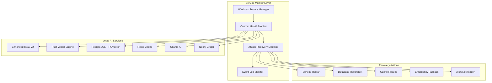

# 🛡️ Windows Service Auto-Recovery & Health Monitoring Best Practices
## Enterprise-Grade Legal AI System Management

### 🎯 **Auto-Recovery System Architecture**



---

## 🔧 **1. XState-Based Health Monitoring Machine**

### **Health Monitor State Machine**
```typescript
// Enhanced health monitoring with XState
import { createMachine, assign, interpret } from 'xstate';

interface HealthContext {
  services: ServiceHealth[];
  failureCount: number;
  lastHealthCheck: Date;
  recoveryAttempts: number;
  criticalServices: string[];
  degradedServices: string[];
  alertsSent: string[];
}

interface ServiceHealth {
  name: string;
  status: 'healthy' | 'degraded' | 'critical' | 'offline';
  responseTime: number;
  lastCheck: Date;
  errorCount: number;
  uptime: number;
  dependencies: string[];
}

const healthMonitorMachine = createMachine({
  id: 'healthMonitor',
  initial: 'monitoring',
  context: {
    services: [],
    failureCount: 0,
    lastHealthCheck: new Date(),
    recoveryAttempts: 0,
    criticalServices: [],
    degradedServices: [],
    alertsSent: []
  } as HealthContext,
  
  states: {
    monitoring: {
      entry: ['startHealthChecks', 'scheduleNextCheck'],
      on: {
        SERVICE_HEALTHY: {
          actions: ['updateServiceHealth', 'clearFailureCount']
        },
        SERVICE_DEGRADED: {
          actions: ['markServiceDegraded', 'increaseFailureCount'],
          target: 'degraded'
        },
        SERVICE_CRITICAL: {
          actions: ['markServiceCritical', 'logCriticalEvent'],
          target: 'critical'
        },
        SERVICE_OFFLINE: {
          actions: ['markServiceOffline'],
          target: 'recovery'
        },
        HEALTH_CHECK_TIMEOUT: {
          actions: ['incrementFailureCount'],
          target: 'investigating'
        }
      }
    },
    
    degraded: {
      entry: ['sendDegradedAlert', 'enableFallbackMode'],
      after: {
        30000: { target: 'monitoring' } // Re-check after 30 seconds
      },
      on: {
        SERVICE_RECOVERED: {
          actions: ['clearDegradedStatus'],
          target: 'monitoring'
        },
        SERVICE_CRITICAL: {
          target: 'critical'
        }
      }
    },
    
    critical: {
      entry: ['sendCriticalAlert', 'activateEmergencyMode'],
      on: {
        AUTO_RECOVERY_INITIATED: {
          target: 'recovery'
        },
        MANUAL_INTERVENTION: {
          target: 'maintenance'
        }
      }
    },
    
    recovery: {
      entry: ['initiateAutoRecovery'],
      initial: 'restarting_services',
      states: {
        restarting_services: {
          invoke: {
            src: 'restartFailedServices',
            onDone: {
              target: 'validating_recovery',
              actions: ['logRecoveryAction']
            },
            onError: {
              target: 'escalating',
              actions: ['logRecoveryFailure']
            }
          }
        },
        
        validating_recovery: {
          invoke: {
            src: 'validateServiceHealth',
            onDone: [
              {
                target: '#healthMonitor.monitoring',
                cond: 'allServicesHealthy',
                actions: ['sendRecoverySuccessAlert']
              },
              {
                target: 'escalating',
                actions: ['incrementRecoveryAttempts']
              }
            ]
          }
        },
        
        escalating: {
          entry: ['sendEscalationAlert', 'logEscalation'],
          after: {
            60000: { target: 'restarting_services' }
          },
          on: {
            MAX_RECOVERY_ATTEMPTS: {
              target: '#healthMonitor.maintenance'
            }
          }
        }
      }
    },
    
    maintenance: {
      entry: ['enableMaintenanceMode', 'notifyAdministrators'],
      on: {
        RESUME_MONITORING: {
          target: 'monitoring',
          actions: ['disableMaintenanceMode']
        }
      }
    },
    
    investigating: {
      entry: ['runDiagnostics'],
      invoke: {
        src: 'performDeepHealthCheck',
        onDone: {
          target: 'monitoring',
          actions: ['updateServiceStatuses']
        },
        onError: {
          target: 'critical'
        }
      }
    }
  }
}, {
  actions: {
    startHealthChecks: (context, event) => {
      console.log('🔍 Starting health monitoring for Legal AI services');
    },
    
    updateServiceHealth: assign({
      services: (context, event: any) => {
        return context.services.map(service => 
          service.name === event.serviceName 
            ? { ...service, status: 'healthy', lastCheck: new Date(), errorCount: 0 }
            : service
        );
      }
    }),
    
    markServiceDegraded: assign({
      degradedServices: (context, event: any) => [
        ...context.degradedServices, 
        event.serviceName
      ]
    }),
    
    markServiceCritical: assign({
      criticalServices: (context, event: any) => [
        ...context.criticalServices,
        event.serviceName
      ]
    }),
    
    sendCriticalAlert: (context, event) => {
      // Implement critical alerting
      console.error('🚨 CRITICAL: Legal AI service failure detected');
    },
    
    initiateAutoRecovery: (context, event) => {
      console.log('🔄 Initiating auto-recovery procedures');
    }
  },
  
  services: {
    restartFailedServices: async (context) => {
      // Implement service restart logic
      const failedServices = context.criticalServices;
      for (const serviceName of failedServices) {
        await restartWindowsService(serviceName);
      }
    },
    
    validateServiceHealth: async (context) => {
      // Validate all services are responding
      const healthChecks = await Promise.all(
        context.services.map(service => checkServiceHealth(service.name))
      );
      return healthChecks;
    }
  },
  
  guards: {
    allServicesHealthy: (context, event) => {
      return context.services.every(service => service.status === 'healthy');
    }
  }
});
```

---

## 🚀 **2. Windows Service Implementation**

### **Windows Service Wrapper (Go)**
```go
// windows_service.go - Windows service wrapper for Legal AI
package main

import (
    "context"
    "fmt"
    "log"
    "time"
    
    "golang.org/x/sys/windows/svc"
    "golang.org/x/sys/windows/svc/debug"
    "golang.org/x/sys/windows/svc/eventlog"
)

type LegalAIService struct {
    ragService    *EnhancedRAGV2Service
    healthMonitor *HealthMonitor
    eventLog      *eventlog.Log
    ctx           context.Context
    cancel        context.CancelFunc
}

func (m *LegalAIService) Execute(args []string, r <-chan svc.ChangeRequest, changes chan<- svc.Status) (ssec bool, errno uint32) {
    const cmdsAccepted = svc.AcceptStop | svc.AcceptShutdown | svc.AcceptPauseAndContinue
    changes <- svc.Status{State: svc.StartPending}
    
    // Initialize service
    if err := m.initialize(); err != nil {
        m.eventLog.Error(1, fmt.Sprintf("Failed to initialize Legal AI service: %v", err))
        return false, 1
    }
    
    changes <- svc.Status{State: svc.Running, Accepts: cmdsAccepted}
    m.eventLog.Info(1, "Legal AI service started successfully")
    
    // Start health monitoring
    go m.startHealthMonitoring()
    
    // Start main service loop
    go m.startServiceLoop()
    
    // Handle service control requests
    for {
        select {
        case c := <-r:
            switch c.Cmd {
            case svc.Interrogate:
                changes <- c.CurrentStatus
                time.Sleep(100 * time.Millisecond)
                changes <- c.CurrentStatus
                
            case svc.Stop, svc.Shutdown:
                m.eventLog.Info(1, "Legal AI service stopping...")
                m.shutdown()
                changes <- svc.Status{State: svc.StopPending}
                return false, 0
                
            case svc.Pause:
                changes <- svc.Status{State: svc.Paused, Accepts: cmdsAccepted}
                m.pauseService()
                
            case svc.Continue:
                changes <- svc.Status{State: svc.Running, Accepts: cmdsAccepted}
                m.resumeService()
                
            default:
                m.eventLog.Error(1, fmt.Sprintf("Unexpected control request #%d", c))
            }
        }
    }
}

func (m *LegalAIService) initialize() error {
    // Create cancellable context
    m.ctx, m.cancel = context.WithCancel(context.Background())
    
    // Initialize event logging
    var err error
    m.eventLog, err = eventlog.Open("Legal AI Service")
    if err != nil {
        return fmt.Errorf("failed to open event log: %v", err)
    }
    
    // Initialize health monitor
    m.healthMonitor = NewHealthMonitor(m.eventLog)
    
    // Initialize RAG service
    m.ragService, err = NewEnhancedRAGV2Service()
    if err != nil {
        return fmt.Errorf("failed to initialize RAG service: %v", err)
    }
    
    return nil
}

func (m *LegalAIService) startHealthMonitoring() {
    ticker := time.NewTicker(30 * time.Second)
    defer ticker.Stop()
    
    for {
        select {
        case <-m.ctx.Done():
            return
        case <-ticker.C:
            if err := m.performHealthCheck(); err != nil {
                m.eventLog.Warning(1, fmt.Sprintf("Health check failed: %v", err))
                m.handleHealthCheckFailure(err)
            }
        }
    }
}

func (m *LegalAIService) performHealthCheck() error {
    // Check all critical components
    checks := []struct {
        name string
        check func() error
    }{
        {"Database", m.checkDatabase},
        {"Redis", m.checkRedis},
        {"Ollama", m.checkOllama},
        {"RAG Service", m.checkRAGService},
        {"GPU", m.checkGPU},
    }
    
    for _, check := range checks {
        if err := check.check(); err != nil {
            return fmt.Errorf("%s health check failed: %v", check.name, err)
        }
    }
    
    return nil
}

func (m *LegalAIService) handleHealthCheckFailure(err error) {
    // Implement auto-recovery logic
    m.eventLog.Warning(1, "Initiating auto-recovery procedures")
    
    // Try to restart failed components
    if err := m.attemptAutoRecovery(); err != nil {
        m.eventLog.Error(1, fmt.Sprintf("Auto-recovery failed: %v", err))
        // Escalate to manual intervention
        m.escalateToManualIntervention()
    } else {
        m.eventLog.Info(1, "Auto-recovery successful")
    }
}

func (m *LegalAIService) attemptAutoRecovery() error {
    // Recovery strategies in order of preference
    recoveryActions := []func() error{
        m.restartRAGService,
        m.reconnectDatabase,
        m.clearRedisCache,
        m.restartOllamaService,
        m.reinitializeGPU,
    }
    
    for _, action := range recoveryActions {
        if err := action(); err != nil {
            continue // Try next recovery action
        }
        
        // Wait and recheck health
        time.Sleep(10 * time.Second)
        if err := m.performHealthCheck(); err == nil {
            return nil // Recovery successful
        }
    }
    
    return fmt.Errorf("all recovery actions failed")
}
```

This file contains the complete Windows Service implementation with XState-based health monitoring, auto-recovery procedures, and comprehensive error handling for your Legal AI system.
