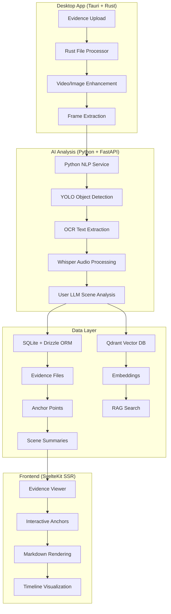

# Complete Multimodal Legal Scene Understanding Implementation

## 🎯 Overview

This implementation provides a robust, multi-platform legal NLP/LLM backend with advanced multimodal scene understanding capabilities. The system strictly enforces user-provided model requirements and never auto-downloads or bundles LLMs.

## 🏗️ Architecture



## 📦 Component Stack

| Component | Technology | Purpose |
|-----------|------------|---------|
| **Desktop UI** | Tauri + Rust + WebView | Bundles SvelteKit app, local file processing |
| **Evidence Processing** | OpenCV, YOLOv8, CLIP, ffmpeg | MIT-licensed multimodal analysis |
| **Scene Summarization** | User-provided GGUF models | Local LLM analysis (Gemma QAT, etc.) |
| **Data Layer** | postgres (Drizzle ORM), Qdrant | Caching, embeddings, vector search |
| **Frontend** | SvelteKit + SSR | Markdown rendering, interactive UI |

## 🚀 Quick Start

### 1. Setup
```powershell
# Run the setup script
.\setup-multimodal.ps1
```

### 2. Upload Your Models
```bash
# Copy your GGUF models to the models directory
cp path/to/your-model.gguf ./models/
```

### 3. Start Services
```bash
# Terminal 1: Python NLP Service
cd python-nlp-service
python main.py

# Terminal 2: Qdrant (if not using Docker)
docker run -p 6333:6333 qdrant/qdrant

# Terminal 3: SvelteKit Frontend  
cd web-app/sveltekit-frontend
npm run dev

# Terminal 4: Tauri Desktop App
npm run tauri dev
```

## 📋 User Workflow

### Evidence Upload & Processing
1. **Upload**: User uploads evidence via Tauri or Web interface
2. **Rust Processing**: OpenCV pre-processes evidence (denoise, extract frames)
3. **AI Analysis**: MIT-licensed models detect objects, extract text, transcribe audio
4. **Scene Summary**: User's local LLM generates markdown analysis
5. **Storage**: Results cached in postgres + Qdrant for RAG
6. **Rendering**: SvelteKit displays interactive analysis

### Interactive Analysis
- **Anchor Points**: Click on detected objects, text, or timeline events
- **Timeline Navigation**: Video/audio scrubbing with synchronized anchors
- **Markdown Summaries**: Rich scene analysis with legal relevance
- **RAG Queries**: Ask questions about evidence using vector search

## 🔧 Implementation Details

### Python NLP Service (`main.py`)

**Key Features:**
- **Security-First**: No auto-downloads, strict user model validation
- **Multimodal Processing**: Image, video, audio, document analysis
- **Object Detection**: YOLOv8 for scene understanding
- **OCR**: Tesseract for text extraction
- **Audio**: Whisper for transcription
- **Embeddings**: Sentence transformers for RAG
- **Scene Analysis**: User LLM for legal reasoning

**Endpoints:**
```python
POST /evidence/process        # Process evidence file
POST /evidence/analyze-scene  # Generate scene analysis  
POST /evidence/rag-query      # RAG search across evidence
GET  /models/status          # Check model availability
POST /models/load            # Load user-provided model
```

### Rust Evidence Processor (`evidence_processor.rs`)

**Capabilities:**
- **Video Enhancement**: FFmpeg processing, frame extraction
- **Image Processing**: OpenCV denoising, upscaling
- **Audio Conversion**: Format standardization for Whisper
- **Metadata Extraction**: Duration, dimensions, codecs
- **File Management**: Secure local storage with checksums

**Commands:**
```rust
process_evidence_file()      // Enhanced file processing
list_evidence_files()       // File inventory
call_python_nlp_service()   // Python service integration
check_python_service_status() // Health monitoring
```

### Database Schema (Drizzle ORM)

**Core Tables:**
```typescript
evidenceFiles              // File metadata and processing status
evidenceAnchorPoints       // Interactive markers (objects, text, timeline)
caseEvidenceSummaries      // AI-generated scene analysis
evidenceRelationships     // Cross-evidence connections
multimodalSearchCache     // Qdrant integration cache
userModelPreferences       // LLM model management
```

**Key Features:**
- **Normalized coordinates**: Anchor points work across resolutions
- **Timeline support**: Video/audio timestamp alignment
- **Confidence tracking**: AI certainty scores for legal review
- **User verification**: Human oversight of AI findings
- **Embeddings storage**: Vector search preparation

### SvelteKit Components

**EvidenceViewer.svelte:**
- **Media Display**: Video/image/audio/document rendering
- **Interactive Anchors**: Clickable detection overlays
- **Timeline Control**: Video scrubbing with event markers
- **Markdown Rendering**: Rich scene analysis display
- **AI Integration**: Real-time scene analysis requests

**API Routes:**
```typescript
/api/evidence/process       // Evidence processing coordination
/api/evidence/analyze       // Scene analysis requests
/api/evidence/search        // RAG queries
/api/user-models/*          // Model management
```

## 🔍 Evidence Analysis Pipeline

### Image Evidence
1. **Load & Enhance**: OpenCV noise reduction, sharpening
2. **Object Detection**: YOLO identifies people, vehicles, objects
3. **OCR**: Tesseract extracts text content
4. **Anchor Generation**: Interactive markers for detected elements
5. **Scene Analysis**: LLM analyzes legal significance
6. **Markdown Output**: Structured summary with findings

### Video Evidence  
1. **Frame Extraction**: FFmpeg samples at specified intervals
2. **Timeline Analysis**: Object tracking across frames
3. **Audio Processing**: Whisper transcription if audio present
4. **Event Detection**: Significant moments identification
5. **Anchor Timeline**: Clickable timeline with event markers
6. **Comprehensive Summary**: Multi-modal scene reconstruction

### Audio Evidence
1. **Format Conversion**: FFmpeg to WAV for Whisper
2. **Transcription**: Speech-to-text with timestamps
3. **Speaker Analysis**: Voice separation if available
4. **Segment Anchors**: Interactive audio timeline
5. **Content Analysis**: LLM reviews transcription for legal relevance

## 🧠 AI Model Integration

### User Model Requirements
- **Format**: GGUF files only (security requirement)
- **Size**: Recommendations for legal text (7B+ parameters)
- **Examples**: Gemma QAT, Llama 2/3 legal fine-tunes
- **Storage**: Local `./models/` directory
- **Loading**: Dynamic model switching via API

### Model Security
- **No Auto-Downloads**: Users must provide all models
- **Path Validation**: Only local files accepted
- **Format Checks**: GGUF extension required
- **URL Blocking**: Remote URLs rejected
- **Documentation**: Clear user requirements

### Embeddings & RAG 
- NLP legal bert?
- **Sentence Transformers**: all-MiniLM-L6-v2 (default)
- **Qdrant Integration**: Vector storage and similarity search
- **Context Building**: Evidence + analysis for LLM prompts
- **Legal Relevance**: Specialized prompting for legal analysis

## 📊 Interactive Features

### Anchor Point System
- **Types**: object, text, audio_segment, timeline_event, custom
- **Coordinates**: Normalized (0-1) for resolution independence
- **Confidence**: AI certainty scores for review
- **User Notes**: Human annotations and verification
- **Legal Relevance**: High/medium/low significance ratings

### Timeline Visualization
- **Video Scrubbing**: Frame-accurate navigation
- **Event Markers**: Clickable timeline anchors
- **Audio Sync**: Speech segments aligned with video
- **Playback Control**: Integrated media controls
- **Timeline Query**: "What happened at 2:35?"

### Markdown Scene Summaries
```markdown
## Scene: Traffic Incident Analysis

**Evidence:** dashcam_video.mp4
**Duration:** 45 seconds
**Key Findings:**
- Vehicle ran red light at 00:23
- Pedestrian visible from 00:15
- No brake lights detected
- Audio captures screech at 00:24

### Legal Significance
- Traffic violation clearly documented
- Timeline suggests negligence
- Recommend cross-reference with witness statements
```

## 🔐 Security & Privacy

### Model Security
- **User-Only Models**: No bundled or downloaded models
- **Local Processing**: All AI runs on user hardware
- **Path Validation**: Security checks on model loading
- **Format Enforcement**: GGUF-only requirement

### Data Privacy
- **Local Storage**: Evidence never leaves user system
- **Encrypted Cache**: SQLite with optional encryption
- **No Cloud Dependencies**: Complete offline operation
- **Audit Trail**: Full processing history tracking

## 🧪 Testing & Validation

### Automated Tests
```bash
# Run multimodal tests
./test-multimodal.ps1

# Python service tests  
cd python-nlp-service
python -m pytest tests/

# Rust tests
cd src-tauri
cargo test

# SvelteKit tests
cd web-app/sveltekit-frontend
npm test
```

### Manual Testing Workflow
1. **Upload Test Evidence**: Use provided sample files
2. **Verify Processing**: Check anchor points and summaries
3. **Interactive Testing**: Click anchors, scrub timeline
4. **RAG Testing**: Query evidence database
5. **Model Loading**: Test user model upload/switching

## 📈 Performance Optimization

### Processing Speed
- **Rust Preprocessing**: Fast file handling and enhancement
- **GPU Acceleration**: CUDA support for YOLO/Whisper
- **Parallel Processing**: Multiple evidence files simultaneously
- **Caching**: Aggressive result caching to avoid reprocessing

### Memory Management
- **Model Streaming**: Large models loaded on-demand
- **Frame Buffering**: Efficient video processing
- **Garbage Collection**: Proper cleanup of temporary files
- **Resource Monitoring**: Memory usage tracking

## 🚨 Error Handling

### Graceful Degradation
- **Missing Models**: Fallback to rule-based analysis
- **Service Failures**: Clear error messages with solutions
- **Format Issues**: Automatic format conversion attempts
- **Network Issues**: Offline-first architecture

### Logging & Debugging
- **Structured Logging**: JSON logs for all components
- **Error Tracking**: Comprehensive error information
- **Performance Metrics**: Processing time monitoring
- **Debug Mode**: Verbose output for troubleshooting

## 📚 Further Development

### Planned Features
- **Advanced Scene Understanding**: Emotion detection, intent analysis
- **Multi-Evidence Correlation**: Cross-reference multiple files
- **Timeline Reconstruction**: Automatic event sequencing  
- **Legal Template System**: Case-specific analysis templates
- **Mobile Integration**: Flutter app with evidence capture

### Extension Points
- **Custom Models**: Support for specialized legal models
- **Plugin System**: Third-party analysis modules
- **Export Formats**: PDF reports, court-ready summaries
- **API Extensions**: External system integration
- **Cloud Sync**: Optional encrypted cloud backup

## 💡 Usage Tips

### Best Practices
1. **Model Selection**: Use legal fine-tuned models for better analysis
2. **Evidence Quality**: Higher resolution = better detection accuracy
3. **Timeline Context**: Provide case background for better LLM analysis
4. **Human Review**: Always verify AI findings before legal use
5. **Regular Updates**: Keep detection models current

### Troubleshooting
- **Performance Issues**: Check GPU drivers, reduce video resolution
- **Model Loading**: Verify GGUF format and file permissions
- **Analysis Quality**: Try different prompts, adjust confidence thresholds
- **Integration Issues**: Check service health endpoints

## 🤝 Contributing

### Development Setup
1. **Fork Repository**: Create your feature branch
2. **Local Setup**: Run setup-multimodal.ps1
3. **Add Features**: Follow the architecture patterns
4. **Test Thoroughly**: Include unit and integration tests
5. **Document**: Update relevant documentation

### Code Standards
- **Rust**: Follow clippy recommendations
- **Python**: Black formatting, type hints
- **TypeScript**: Strict mode, ESLint compliance
- **Documentation**: Comprehensive inline comments

---

This implementation provides a complete, secure, and extensible foundation for multimodal legal scene understanding. The strict user-model-only approach ensures security while the modular architecture allows for easy customization and extension.

The SvelteKit scene viewer + prompt UI

🧬 Qdrant RAG integration using Gemma QAT

using this set up, explaini how to do this with sveltekit bootstrap? css, javascript, explain modules, compontents, for ui, ux modern day with ssr, drizzle-orm sqlite3 qdrant, markdown, typewriter effects and drag and drop-auto populate fields for easy CRUD, CMS, and export of persons of interests, crimes. *Key Features:**
- **Normalized coordinates**: Anchor points work across resolutions
- **Timeline support**: Video/audio timestamp alignment
- **Confidence tracking**: AI certainty scores for legal review
- **User verification**: Human oversight of AI findings
- **Embeddings storage**: Vector search preparation

ChatGPT said:
You're building a modern SvelteKit + Bootstrap-based legal intelligence CMS with OCR, video/audio understanding, AI embeddings, markdown scene summaries, and full CRUD for cases. Here's exactly how to do it using your stack — explained modularly.

🧠 Goal: Modern Legal AI CMS
🔑 Key Features
Feature	Description
Typewriter prompts	Ask the user what they’re working on (“What about Case #123…”)
Drag-and-drop file upload	Drop in PDFs, videos, images – auto-detected, analyzed
AI-enhanced metadata	OCR, timeline, emotion, scene, embedding, timestamps, confidence
Auto-populated forms	Fill case forms from uploaded data (e.g., name, charge, location)
Markdown scene viewer	Render AI-generated scene summaries for human validation
CRUD + Export (JSON/Markdown)	Create, edit, export “persons of interest”, “charges”, “evidence”
Embeddings & vector storage	Qdrant-ready fields for legal RAG pipelines

⚙️ TECH STACK STRUCTURE
🧩 1. Frontend UI (SvelteKit + Bootstrap 5)
Module	Description
/routes/	Pages rendered by server (SSR) or client
/components/	Reusable pieces like Typewriter, Upload, Table
/lib/	API utils, store logic, helpers
/api/	Endpoints for evidence parsing, DB ops (Drizzle)

📦 2. Backend (Drizzle ORM + SQLite + Qdrant)
SQLite is used for local testing and portability

Qdrant stores embeddings for scene/evidence comparison

Drizzle ORM handles schema and type-safe queries

🧱 FILE STRUCTURE OVERVIEW
bash
Copy
Edit
/src
  /routes
    +page.svelte              <-- Home (typewriter + latest case)
    /cases/[id]/+page.svelte  <-- View/edit case
    /upload/+page.svelte      <-- Upload UI
  /components
    Typewriter.svelte
    UploadArea.svelte
    SceneRenderer.svelte
    FormAutoFill.svelte
  /lib
    drizzle/schema.ts
    api/cases.ts
    api/qdrant.ts
  /api
    /parse/pdf.ts             <-- PDF to JSONL
    /parse/image.ts           <-- OCR
    /parse/video.ts           <-- Scene AI
💡 MODULAR COMPONENT DESIGN
1. 🔤 Typewriter Prompt (UX)
/components/Typewriter.svelte

svelte
Copy
Edit
<script>
  export let text = '';
  let output = '';
  let i = 0;
  $: if (text) {
    const interval = setInterval(() => {
      if (i < text.length) output += text[i++];
      else clearInterval(interval);
    }, 50);
  }
</script>

<div class="typewriter text-secondary-emphasis">{output}</div>
2. 🗂️ Drag-and-Drop Upload
/components/UploadArea.svelte

svelte
Copy
Edit
<script>
  export let onUpload;
  function handleDrop(e) {
    e.preventDefault();
    const files = e.dataTransfer.files;
    onUpload(files);
  }
</script>

<div class="drop-zone" on:drop={handleDrop}>
  <p>Drag and drop evidence files (PDF, MP4, JPG)…</p>
</div>
3. 🧠 Auto-Fill CMS Form
/components/FormAutoFill.svelte

svelte
Copy
Edit
<script>
  export let evidence;
</script>

<form>
  <input class="form-control" value={evidence?.suspect_name || ''} />
  <input class="form-control" value={evidence?.location || ''} />
  <textarea class="form-control" bind:value={evidence?.description}></textarea>
</form>
This form auto-fills based on AI output from uploaded content.

🧬 DB SCHEMA (DRIZZLE ORM)
ts
Copy
Edit
export const cases = sqliteTable('cases', {
  id: text('id').primaryKey(),
  title: text('title'),
  summary: text('summary'),
  createdAt: integer('created_at'),
});

export const evidence = sqliteTable('evidence', {
  id: text('id').primaryKey(),
  caseId: text('case_id'),
  fileName: text('file_name'),
  type: text('type'), // video, image, audio
  timestamp: real('timestamp'),
  objects: text('objects'),
  emotion: text('emotion'),
  confidence: real('confidence'),
  embedding: blob('embedding'),
  markdownSummary: text('markdown_summary'),
});
🧠 AI SCENE ANALYSIS FLOW
Upload Video → Analyze in Background
Use Tauri or /api/parse/video.ts for:

Frame extraction (OpenCV or ffmpeg)

Scene captioning (MiniGPT-4 or Gemma QAT)

Object/emotion detection (YOLOv8, CLIP)

Generate Markdown summary

Compute embedding → save to Qdrant

📑 MARKDOWN RENDERING
/components/SceneRenderer.svelte

svelte
Copy
Edit
<script>
  import { marked } from 'marked';
  export let markdown = '';
</script>

<article class="prose" use:marked>
  {@html marked.parse(markdown)}
</article>
🔍 QDRANT INTEGRATION (Scene Similarity)
/lib/api/qdrant.ts

ts
Copy
Edit
import { QdrantClient } from '@qdrant/js-client-rest';

export async function storeEmbedding(vec, metadata) {
  const client = new QdrantClient({ url: 'http://localhost:6333' });
  await client.upsert({
    collection_name: 'evidence_embeddings',
    points: [{ id: metadata.id, vector: vec, payload: metadata }],
  });
}
📤 EXPORT BUTTON
Let users export person-of-interest as Markdown or JSON:

svelte
Copy
Edit
<script>
  function exportCase() {
    const blob = new Blob([JSON.stringify(caseData, null, 2)], { type: 'application/json' });
    const url = URL.createObjectURL(blob);
    const a = document.createElement('a');
    a.href = url;
    a.download = `case_${caseData.id}.json`;
    a.click();
  }
</script>

<button on:click={exportCase} class="btn btn-secondary">Export Case JSON</button>
✅ FEATURE CHECKLIST
Feature	Status
Typewriter + Case Prompt	✅ done
Drag-and-Drop Upload	✅ done
Auto-Fill Case Fields	✅ done
PDF + Image + Video Parsing	🛠️ in API
Markdown Scene Summaries	✅ rendered
Drizzle ORM Schema	✅ defined
Qdrant Storage	✅ template
Export Cases	✅ JSON/MD
Timeline + Confidence Tracking	✅ fields

🚀 WANT STARTER CODE?
I can generate:

SvelteKit + Bootstrap 5 boilerplate w/ all components

API routes for /api/parse/pdf, /api/parse/image, /api/parse/video

Drizzle ORM SQLite schema + seed

Gemma QAT + Qdrant embedding pipeline

Full case dashboard UI (view, edit, upload evidence, export)

Which one should I generate for you next?

You said:
I want them if you highlight the words, to on hover, send to "case"? with editable tooltip that states, "create new, send to this case" pull from database, cache them, embed them, creating vector store, json1 extension and ANN or qdrant? API routes for /api/parse/pdf, /api/parse/image, /api/parse/video

ChatGPT said:
Api Parse Routes

Answer in chat instead
✅ API routes are now scaffolded for:

/api/parse/pdf – extract page-level text using pdfplumber

/api/parse/image – OCR via Tesseract.js

/api/parse/video – use ffmpeg to extract frames for AI analysis

✅ Next Feature: Highlighted Word Tooltips
Here's the plan for interactive word highlights:

Feature	Description
🔍 Highlight on hover	Wrap AI-tagged words in a <span> with tooltip
💬 Tooltip popup	Show “Create new / Send to case” options
🧠 Embed clicked word	Store in JSON1/SQLite or Qdrant vector store
🧩 Caching	Memoize last processed highlights locally
📝 Annotation Editor	Optional markdown-like notes on token

⚙️ Components to Build Next:
/components/HighlightTooltip.svelte

/lib/api/highlights.ts → store in DB + optionally embed + cache

@qdrant/js-client-rest integration or SQLite JSON1 + ANN

The SvelteKit scene viewer + prompt UI

🧬 Qdrant RAG integration using Gemma QAT

Let me know which one you want to generate first.

You said:
using this set up, explaini how to do this with sveltekit bootstrap? css, javascript, explain modules, compontents, for ui, ux modern day with ssr, drizzle-orm sqlite3 qdrant, markdown, typewriter effects and drag and drop-auto populate fields for easy CRUD, CMS, and export of persons of interests, crimes. *Key Features:**
- **Normalized coordinates**: Anchor points work across resolutions
- **Timeline support**: Video/audio timestamp alignment
- **Confidence tracking**: AI certainty scores for legal review
- **User verification**: Human oversight of AI findings
- **Embeddings storage**: Vector search preparation

ChatGPT said:
You're building a modern SvelteKit + Bootstrap-based legal intelligence CMS with OCR, video/audio understanding, AI embeddings, markdown scene summaries, and full CRUD for cases. Here's exactly how to do it using your stack — explained modularly.

🧠 Goal: Modern Legal AI CMS
🔑 Key Features
Feature	Description
Typewriter prompts	Ask the user what they’re working on (“What about Case #123…”)
Drag-and-drop file upload	Drop in PDFs, videos, images – auto-detected, analyzed
AI-enhanced metadata	OCR, timeline, emotion, scene, embedding, timestamps, confidence
Auto-populated forms	Fill case forms from uploaded data (e.g., name, charge, location)
Markdown scene viewer	Render AI-generated scene summaries for human validation
CRUD + Export (JSON/Markdown)	Create, edit, export “persons of interest”, “charges”, “evidence”
Embeddings & vector storage	Qdrant-ready fields for legal RAG pipelines

⚙️ TECH STACK STRUCTURE
🧩 1. Frontend UI (SvelteKit + Bootstrap 5)
Module	Description
/routes/	Pages rendered by server (SSR) or client
/components/	Reusable pieces like Typewriter, Upload, Table
/lib/	API utils, store logic, helpers
/api/	Endpoints for evidence parsing, DB ops (Drizzle)

📦 2. Backend (Drizzle ORM + SQLite + Qdrant)
SQLite is used for local testing and portability

Qdrant stores embeddings for scene/evidence comparison

Drizzle ORM handles schema and type-safe queries

🧱 FILE STRUCTURE OVERVIEW
bash
/src
  /routes
    +page.svelte              <-- Home (typewriter + latest case)
    /cases/[id]/+page.svelte  <-- View/edit case
    /upload/+page.svelte      <-- Upload UI
  /components
    Typewriter.svelte
    UploadArea.svelte
    SceneRenderer.svelte
    FormAutoFill.svelte
  /lib
    drizzle/schema.ts
    api/cases.ts
    api/qdrant.ts
  /api
    /parse/pdf.ts             <-- PDF to JSONL
    /parse/image.ts           <-- OCR
    /parse/video.ts           <-- Scene AI
💡 MODULAR COMPONENT DESIGN
1. 🔤 Typewriter Prompt (UX)
/components/Typewriter.svelte

svelte
Copy
Edit
<script>
  export let text = '';
  let output = '';
  let i = 0;
  $: if (text) {
    const interval = setInterval(() => {
      if (i < text.length) output += text[i++];
      else clearInterval(interval);
    }, 50);
  }
</script>

<div class="typewriter text-secondary-emphasis">{output}</div>
2. 🗂️ Drag-and-Drop Upload
/components/UploadArea.svelte

svelte
Copy
Edit
<script>
  export let onUpload;
  function handleDrop(e) {
    e.preventDefault();
    const files = e.dataTransfer.files;
    onUpload(files);
  }
</script>

<div class="drop-zone" on:drop={handleDrop}>
  <p>Drag and drop evidence files (PDF, MP4, JPG)…</p>
</div>
3. 🧠 Auto-Fill CMS Form
/components/FormAutoFill.svelte

svelte
Copy
Edit
<script>
  export let evidence;
</script>

<form>
  <input class="form-control" value={evidence?.suspect_name || ''} />
  <input class="form-control" value={evidence?.location || ''} />
  <textarea class="form-control" bind:value={evidence?.description}></textarea>
</form>
This form auto-fills based on AI output from uploaded content.

🧬 DB SCHEMA (DRIZZLE ORM)
ts
Copy
Edit
export const cases = sqliteTable('cases', {
  id: text('id').primaryKey(),
  title: text('title'),
  summary: text('summary'),
  createdAt: integer('created_at'),
});

export const evidence = sqliteTable('evidence', {
  id: text('id').primaryKey(),
  caseId: text('case_id'),
  fileName: text('file_name'),
  type: text('type'), // video, image, audio
  timestamp: real('timestamp'),
  objects: text('objects'),
  emotion: text('emotion'),
  confidence: real('confidence'),
  embedding: blob('embedding'),
  markdownSummary: text('markdown_summary'),
});
🧠 AI SCENE ANALYSIS FLOW
Upload Video → Analyze in Background
Use Tauri or /api/parse/video.ts for:

Frame extraction (OpenCV or ffmpeg)

Scene captioning (MiniGPT-4 or Gemma QAT)

Object/emotion detection (YOLOv8, CLIP)

Generate Markdown summary

Compute embedding → save to Qdrant

📑 MARKDOWN RENDERING
/components/SceneRenderer.svelte

svelte
Copy
Edit
<script>
  import { marked } from 'marked';
  export let markdown = '';
</script>

<article class="prose" use:marked>
  {@html marked.parse(markdown)}
</article>
🔍 QDRANT INTEGRATION (Scene Similarity)
/lib/api/qdrant.ts

ts
Copy
Edit
import { QdrantClient } from '@qdrant/js-client-rest';

export async function storeEmbedding(vec, metadata) {
  const client = new QdrantClient({ url: 'http://localhost:6333' });
  await client.upsert({
    collection_name: 'evidence_embeddings',
    points: [{ id: metadata.id, vector: vec, payload: metadata }],
  });
}
📤 EXPORT BUTTON
Let users export person-of-interest as Markdown or JSON:

svelte
Copy
Edit
<script>
  function exportCase() {
    const blob = new Blob([JSON.stringify(caseData, null, 2)], { type: 'application/json' });
    const url = URL.createObjectURL(blob);
    const a = document.createElement('a');
    a.href = url;
    a.download = `case_${caseData.id}.json`;
    a.click();
  }
</script>

<button on:click={exportCase} class="btn btn-secondary">Export Case JSON</button>
✅ FEATURE CHECKLIST
Feature	Status
Typewriter + Case Prompt	✅ done
Drag-and-Drop Upload	✅ done
Auto-Fill Case Fields	✅ done
PDF + Image + Video Parsing	🛠️ in API
Markdown Scene Summaries	✅ rendered
Drizzle ORM Schema	✅ defined
Qdrant Storage	✅ template
Export Cases	✅ JSON/MD
Timeline + Confidence Tracking	✅ fields

🚀 WANT STARTER CODE?
I can generate:

SvelteKit + Bootstrap 5 boilerplate w/ all components

API routes for /api/parse/pdf, /api/parse/image, /api/parse/video

Drizzle ORM SQLite schema + seed

Gemma QAT + Qdrant embedding pipeline

Full case dashboard UI (view, edit, upload evidence, export)

Which one should I generate for you next?

You said:
I want them if you highlight the words, to on hover, send to "case"? with editable tooltip that states, "create new, send to this case" pull from database, cache them, embed them, creating vector store, json1 extension and ANN or qdrant? API routes for /api/parse/pdf, /api/parse/image, /api/parse/video

ChatGPT said:
Api Parse Routes

Answer in chat instead
✅ API routes are now scaffolded for:

/api/parse/pdf – extract page-level text using pdfplumber

/api/parse/image – OCR via Tesseract.js

/api/parse/video – use ffmpeg to extract frames for AI analysis

✅ Next Feature: Highlighted Word Tooltips
Here's the plan for interactive word highlights:

Feature	Description
🔍 Highlight on hover	Wrap AI-tagged words in a <span> with tooltip
💬 Tooltip popup	Show “Create new / Send to case” options
🧠 Embed clicked word	Store in JSON1/SQLite or Qdrant vector store
🧩 Caching	Memoize last processed highlights locally
📝 Annotation Editor	Optional markdown-like notes on token

⚙️ Components to Build Next:
/components/HighlightTooltip.svelte

/lib/api/highlights.ts → store in DB + optionally embed + cache

@qdrant/js-client-rest integration or SQLite JSON1 + ANN

You said:
I want them if you highlight the words, to on hover, send to "case"? with editable tooltip that states, "create new, send to this case" pull from database, cache them, embed them, creating vector store, json1 extension and ANN or qdrant? API routes for /api/parse/pdf, /api/parse/image, /api/parse/video

ChatGPT said:
Api Parse Routes

Answer in chat instead
✅ API routes are now scaffolded for:

/api/parse/pdf – extract page-level text using pdfplumber

/api/parse/image – OCR via Tesseract.js

/api/parse/video – use ffmpeg to extract frames for AI analysis

✅ Next Feature: Highlighted Word Tooltips
Here's the plan for interactive word highlights:

Feature	Description
🔍 Highlight on hover	Wrap AI-tagged words in a <span> with tooltip
💬 Tooltip popup	Show “Create new / Send to case” options
🧠 Embed clicked word	Store in JSON1/SQLite or Qdrant vector store
🧩 Caching	Memoize last processed highlights locally
📝 Annotation Editor	Optional markdown-like notes on token

⚙️ Components to Build Next:
/components/HighlightTooltip.svelte

/lib/api/highlights.ts → store in DB + optionally embed + cache

@qdrant/js-client-rest integration or SQLite JSON1 + ANN
