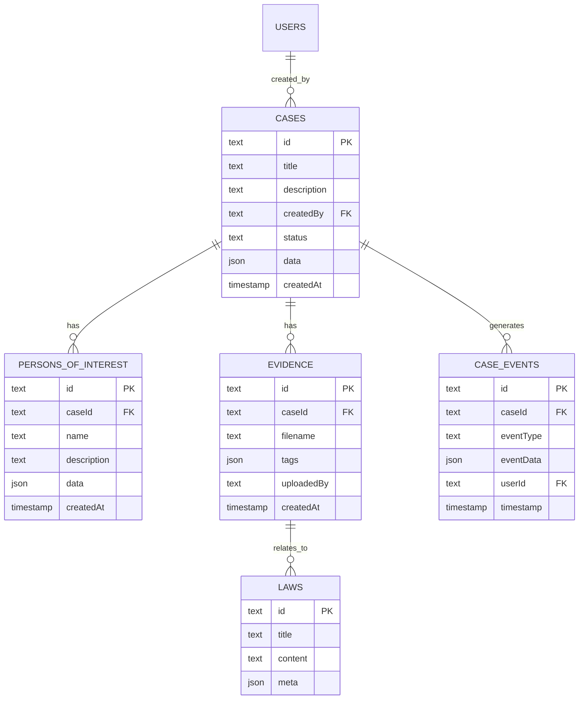

# Deeds Application Enhancement Plan

This document outlines the detailed plan for enhancing the Deeds application with advanced features including AI/NLP for legal text analysis, semantic search, improved data management for "persons of interest," and enhanced UI/UX for case management.

## Key Information Gathered:

*   **Database Schema**: The existing schema defines `users`, `cases`, `evidence`, and `laws` tables, with JSON blob support.
*   **"Person of Interest"**: Will be a new Drizzle ORM table with a foreign key relationship to "cases."
*   **Qdrant**: Already set up and accessible; the focus will be on integration.
*   **Local LLM**: Needs to be included in the plan, including setup (e.g., Ollama, Llama.cpp) and integration.
*   **PDF Export**: A future enhancement, not a hard requirement for initial implementation.
*   **"Document array with a matrix"**: Refers to organizing and inter-relating cases, auto-completing form fields from saved statements, merging cases, and generating summaries/recommendations using NLP and the local LLM. This also involves drag-and-drop functionality and SSR for UI/UX.
*   **SSR Rendering through API Layouts**: Refers to SvelteKit's `+layout.server.ts` files fetching data from API routes (`+server.ts`).
*   **Searchability and Connections**: Both explicit relationships (foreign keys, tags) and semantic connections (NLP-driven similarity) are desired. The small record count (1,000) suggests that a simple auto-encoder might be sufficient for semantic search, but a more robust embedding model will be needed for effective NLP.

## Detailed Plan:

### Phase 1: Core Data Model and API Enhancements

1.  **Update Drizzle Configuration**:
    *   Correct the `schema` path in [`drizzle.config.ts`](drizzle.config.ts) to point to [`./web-app/sveltekit-frontend/src/lib/server/db/schema.ts`](web-app/sveltekit-frontend/src/lib/server/db/schema.ts).
2.  **Implement "Persons of Interest" Table**:
    *   Add a new Drizzle ORM table named `personsOfInterest` to [`web-app/sveltekit-frontend/src/lib/server/db/schema.ts`](web-app/sveltekit-frontend/src/lib/server/db/schema.ts).
    *   Establish a foreign key relationship between `personsOfInterest` and `cases` (e.g., a `caseId` field in `personsOfInterest` for a one-to-many relationship).
    *   Create corresponding API endpoints (`+server.ts`) for CRUD operations on `personsOfInterest` (e.g., `/api/persons-of-interest`).
3.  **Refactor Caching Mechanism**:
    *   Implement a server-side caching mechanism (e.g., using a simple in-memory cache or LokiJS if desired) within `web-app/sveltekit-frontend/src/lib/server/cache/`.
    *   Integrate this cache into the SvelteKit API routes (`+server.ts`) to cache frequently accessed data (e.g., "most recent cases").
    *   Implement `invalidateCache` with wildcard handling for efficient cache invalidation.

### Phase 2: AI/NLP and Semantic Search Integration

1.  **Local LLM Setup and Integration**:
    *   Provide instructions for setting up a local LLM (e.g., Ollama or Llama.cpp) as a prerequisite.
    *   Create a new SvelteKit API endpoint (e.g., [`web-app/sveltekit-frontend/src/routes/api/llm/analyze/+server.ts`](web-app/sveltekit-frontend/src/routes/api/llm/analyze/+server.ts)) to interact with the local LLM.
    *   Develop a utility module (e.g., [`web-app/sveltekit-frontend/src/lib/nlp/analyzer.ts`](web-app/sveltekit-frontend/src/lib/nlp/analyzer.ts)) to encapsulate the logic for interacting with the LLM, including:
        *   **Entity Extraction**: Identifying names, locations, dates, and other relevant entities from text.
        *   **Text Summarization**: Generating concise summaries of case descriptions.
        *   **Embedding Generation**: Converting text into numerical vector embeddings for semantic search.
        *   **Legal NLP**: Incorporating specific NLP techniques for legal text analysis.
2.  **Qdrant Integration for Semantic Search**:
    *   Integrate Qdrant with the application by:
        *   Creating a Qdrant client in the SvelteKit backend.
        *   Defining Qdrant collections for storing vector embeddings of case descriptions, evidence, and law paragraphs.
        *   When new data is added/updated, use the local LLM to generate embeddings and store them in Qdrant.
        *   Implement a semantic search API endpoint (e.g., `/api/search/semantic`) that queries Qdrant.
    *   Consider caching Qdrant search results in the server-side cache.

### Phase 3: UI/UX Enhancements and Workflow Automation

1.  **Auto-complete Form Fields**:
    *   Implement auto-complete functionality for form fields using data from previously saved statements and NLP-extracted entities.
2.  **Drag-and-Drop Functionality**:
    *   Enhance the UI to support drag-and-drop for organizing information (e.g., attaching evidence, moving text between cases).
    *   Utilize SvelteKit stores (e.g., `dragDropStore`) for managing client-side state.
3.  **Case Merging and Inter-relation**:
    *   Develop backend logic and UI components to merge and inter-relate cases.
    *   Leverage NLP to suggest related cases based on semantic similarity from Qdrant.
4.  **Recommender NLP**:
    *   Implement a "pick up on this case" recommender feature using the local LLM and Qdrant for semantic similarity.
5.  **SSR Rendering with API Layouts**:
    *   Ensure SvelteKit's `+layout.server.ts` files effectively fetch data from API routes (`+server.ts`) for efficient Server-Side Rendering.
6.  **State Machines for Complex Workflows**:
    *   Integrate the `caseStateMachine` into the application logic to manage case lifecycles.
7.  **Event Store Pattern**:
    *   Implement the `caseEvents` table and `logCaseEvent` function for auditing case modifications.

### Phase 4: Future Enhancements (PDF Export)

1.  **PDF Export using PDFKit**:
    *   (To be implemented in a later phase)
    *   Develop a server-side endpoint to generate PDF reports using PDFKit.

## High-Level Architecture

```mermaid
graph TD
    User -->|Browser (SvelteKit UI)| SvelteKit_Frontend
    SvelteKit_Frontend -->|Client-side Stores ($page, userSessionStore, dragDropStore)| SvelteKit_Frontend
    SvelteKit_Frontend -->|API Calls| SvelteKit_Backend

    subgraph SvelteKit_Backend
        SvelteKit_Backend -->|Drizzle ORM| postgres_DB
        SvelteKit_Backend -->|Qdrant Client| Qdrant_DB
        SvelteKit_Backend -->|LLM API| Local_LLM_Service
        SvelteKit_Backend -->|Server-side Cache (WardenNetCache)| In_Memory_Cache
    end

    postgres_DB[postgres Database]
    Qdrant_DB[Qdrant Vector Database]
    Local_LLM_Service[Local LLM Service (Ollama/Llama.cpp)]
    In_Memory_Cache[Server-side Cache]

    subgraph Data Flow
        postgres_DB --> |Case Data, Persons of Interest, Evidence, Laws| SvelteKit_Backend
        Local_LLM_Service --> |Embeddings, NLP Analysis| Qdrant_DB
        Local_LLM_Service --> |Auto-complete Suggestions, Summaries| SvelteKit_Backend
        Qdrant_DB --> |Semantic Search Results| SvelteKit_Backend
        SvelteKit_Backend --> |Cached Data| In_Memory_Cache
        In_Memory_Cache --> |Faster API Responses| SvelteKit_Frontend
    end

    subgraph Key Features
        A[Auto-complete Form Fields]
        B[Drag-and-Drop UI]
        C[Case Merging/Inter-relation]
        D[Recommender NLP]
        E[State Machine Workflow]
        F[Event Store Logging]
    end

    SvelteKit_Frontend --> A
    SvelteKit_Frontend --> B
    SvelteKit_Backend --> C
    SvelteKit_Backend --> D
    SvelteKit_Backend --> E
    SQLite_DB --> F
```

## Data Model (Simplified)



## Additional Considerations:

*   **Frontend UI Components**: Specific Svelte components for displaying lists, detail views, forms, search interfaces, and user authentication.
*   **Authentication and Authorization**: Robust implementation of login, registration, session management, and authorization checks for API routes.
*   **Deployment Strategy**: Considerations for deploying the SvelteKit app, SQLite database, Qdrant, and local LLM.
*   **Testing**: Comprehensive unit, integration, and end-to-end tests.
*   **Error Handling and Logging**: Robust error handling and a centralized logging mechanism.
*   **Environment Variables**: Proper management of environment variables.
*   **Input Validation**: Server-side and client-side validation for all user inputs.
*   **Security**: Beyond authentication, consider other security aspects like rate limiting, XSS protection, and secure data storage.
*   **File Uploads**: A robust file upload mechanism for evidence.
*   **Background Processing**: For tasks like generating embeddings for large documents or complex NLP analysis, consider background jobs or queues.
*   **Monitoring and Analytics**: Tools for monitoring application performance, errors, and user behavior.
*   **Documentation**: Clear documentation for setup, development, and deployment.