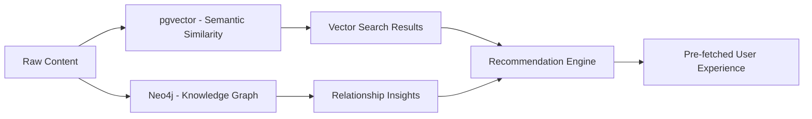

# Phase 13: Long-term Relationship Analytics & Advanced RAG System

## 🎯 **Phase 13 Vision: Knowledge Graph Intelligence**
*Target Implementation: August 2025*  
*Status: 🚧 IN DEVELOPMENT*

Building upon Phase 12's solid foundation, Phase 13 introduces sophisticated relationship analytics, multi-agent orchestration, and an advanced RAG pipeline that transforms static document storage into an intelligent, interconnected knowledge system.

---

## 🧠 **Core Innovation: Hybrid pgvector + Neo4j Architecture**

### **The Two-Database Strategy**



#### **pgvector Role: Source of Truth & Semantic Search**
- **Primary Function**: "What content is semantically similar to this?"
- **Strengths**: Lightning-fast vector similarity, massive scale
- **Storage**: Raw content, embeddings, metadata
- **Query Time**: < 200ms for 100k+ documents

#### **Neo4j Role: Knowledge & Relationship Graph**
- **Primary Function**: "Given what we know, what patterns lead to relevant recommendations?"
- **Strengths**: Multi-hop queries, complex relationship traversal
- **Storage**: Entities, relationships, inferred connections
- **Query Time**: Complex traversals in < 500ms

---

## 🏗️ **Architecture Components**

### **1. Enhanced RAG Pipeline with Article Fetching**

```typescript
// Enhanced RAG Service with External Article Integration
export class EnhancedRAGService {
  async processExtendedThinking(query: string, options: ExtendedThinkingOptions) {
    // Phase 1: External Article Fetching
    const articles = await this.fetchRelevantArticles(query, options.sources);
    
    // Phase 2: Content Processing & Embedding
    const processedContent = await Promise.all(
      articles.map(article => this.processArticle(article))
    );
    
    // Phase 3: Knowledge Graph Population
    await this.populateKnowledgeGraph(processedContent);
    
    // Phase 4: Hybrid Search & Synthesis
    const vectorResults = await this.semanticSearch(query);
    const graphInsights = await this.graphTraversal(query);
    
    // Phase 5: LLM Synthesis with Rich Context
    return await this.synthesizeWithContext(query, {
      vectorResults,
      graphInsights,
      externalArticles: processedContent
    });
  }
}
```

#### **Article Fetching Strategy**
```typescript
interface ArticleFetcher {
  // Legal databases
  fetchFromWestlaw(query: string): Promise<LegalArticle[]>;
  fetchFromLexisNexis(query: string): Promise<LegalArticle[]>;
  
  // Academic sources
  fetchFromSSRN(query: string): Promise<AcademicPaper[]>;
  fetchFromArXiv(query: string): Promise<ResearchPaper[]>;
  
  // News and analysis
  fetchFromLegalNews(query: string): Promise<NewsArticle[]>;
  fetchFromCourtDecisions(query: string): Promise<CourtDecision[]>;
}
```

### **2. BullMQ Advanced Queue System**

```typescript
// Replace RabbitMQ with BullMQ for TypeScript-native queuing
export class LegalAIQueueManager {
  private queues: Map<string, Queue> = new Map();
  
  constructor() {
    this.setupQueues();
  }
  
  private setupQueues() {
    // Document processing queue
    this.queues.set('document-processing', new Queue('document-processing', {
      connection: this.redisConnection,
      defaultJobOptions: {
        removeOnComplete: 100,
        removeOnFail: 50,
        attempts: 3,
        backoff: {
          type: 'exponential',
          delay: 2000,
        }
      }
    }));
    
    // RAG pipeline queue
    this.queues.set('rag-pipeline', new Queue('rag-pipeline', {
      connection: this.redisConnection,
      defaultJobOptions: {
        removeOnComplete: 50,
        removeOnFail: 25,
        attempts: 2
      }
    }));
    
    // Graph analytics queue (long-running background jobs)
    this.queues.set('graph-analytics', new Queue('graph-analytics', {
      connection: this.redisConnection,
      defaultJobOptions: {
        removeOnComplete: 20,
        removeOnFail: 10,
        attempts: 1,
        delay: 5000 // Batch processing delay
      }
    }));
  }
  
  async processExtendedThinking(jobData: ExtendedThinkingJob) {
    const job = await this.queues.get('rag-pipeline')!.add(
      'extended-thinking',
      jobData,
      {
        priority: jobData.priority || 10,
        delay: jobData.delay || 0
      }
    );
    
    return job.id;
  }
}
```

### **3. Neo4j Knowledge Graph Construction**

```typescript
// Legal Knowledge Graph Builder
export class LegalKnowledgeGraphBuilder {
  private neo4jSession: Session;
  
  async extractEntitiesAndRelationships(content: string): Promise<GraphData> {
    // Use Gemma3-legal for entity extraction
    const extractionPrompt = `
    Analyze this legal content and extract:
    1. Key entities (people, organizations, legal concepts, statutes, cases)
    2. Relationships between entities
    3. Legal precedents and citations
    4. Topic classifications
    
    Return as structured JSON:
    {
      "entities": [
        {"id": "entity_id", "type": "person|organization|concept|case|statute", "name": "...", "attributes": {...}},
      ],
      "relationships": [
        {"source": "entity_id1", "target": "entity_id2", "type": "CITES|RELATES_TO|CONFLICTS_WITH|SUPPORTS", "strength": 0.8}
      ],
      "topics": ["contract_law", "intellectual_property", "litigation"]
    }
    
    Content: ${content.slice(0, 4000)}
    `;
    
    const response = await this.llmService.generate({
      model: 'gemma3-legal',
      prompt: extractionPrompt,
      temperature: 0.2
    });
    
    return JSON.parse(response);
  }
  
  async populateGraph(graphData: GraphData, sourceDocumentId: string) {
    const session = this.neo4jSession;
    
    // Create entities
    for (const entity of graphData.entities) {
      await session.run(`
        MERGE (e:${entity.type} {id: $id, name: $name})
        SET e += $attributes
        SET e.last_updated = datetime()
      `, {
        id: entity.id,
        name: entity.name,
        attributes: entity.attributes
      });
    }
    
    // Create relationships
    for (const rel of graphData.relationships) {
      await session.run(`
        MATCH (source {id: $sourceId}), (target {id: $targetId})
        MERGE (source)-[r:${rel.type}]->(target)
        SET r.strength = $strength
        SET r.source_document = $documentId
        SET r.created_at = datetime()
      `, {
        sourceId: rel.source,
        targetId: rel.target,
        strength: rel.strength,
        documentId: sourceDocumentId
      });
    }
    
    // Link to source document
    await session.run(`
      MATCH (doc:Document {id: $documentId})
      MATCH (entity) WHERE entity.id IN $entityIds
      MERGE (doc)-[:CONTAINS]->(entity)
    `, {
      documentId: sourceDocumentId,
      entityIds: graphData.entities.map(e => e.id)
    });
  }
}
```

### **4. Advanced Recommendation Engine**

```typescript
// Multi-faceted Recommendation System
export class LegalRecommendationEngine {
  async generateRecommendations(userId: string, context: RecommendationContext): Promise<Recommendation[]> {
    // Combine multiple recommendation strategies
    const strategies = await Promise.all([
      this.contentBasedRecommendations(userId, context),
      this.collaborativeFiltering(userId, context),
      this.graphBasedRecommendations(userId, context),
      this.temporalRecommendations(userId, context)
    ]);
    
    // Weighted fusion of recommendation strategies
    return this.fuseRecommendations(strategies, {
      contentWeight: 0.3,
      collaborativeWeight: 0.25,
      graphWeight: 0.35,
      temporalWeight: 0.1
    });
  }
  
  private async graphBasedRecommendations(userId: string, context: RecommendationContext): Promise<Recommendation[]> {
    // Complex Neo4j traversal for legal recommendations
    const cypher = `
      // Find user's recent interactions
      MATCH (u:User {id: $userId})-[:VIEWED|LIKED|BOOKMARKED]->(doc:Document)
      WHERE doc.created_at > datetime() - duration('P30D')
      
      // Find similar documents through various paths
      MATCH (doc)-[:RELATES_TO|CITES|SIMILAR_TO*1..3]->(related:Document)
      WHERE NOT (u)-[:VIEWED]->(related)
      
      // Find documents on similar legal topics
      MATCH (doc)-[:CONTAINS]->(entity)-[:RELATES_TO]->(topic:LegalTopic)
      MATCH (topic)<-[:RELATES_TO]-(otherEntity)<-[:CONTAINS]-(recommended:Document)
      WHERE NOT (u)-[:VIEWED]->(recommended)
      
      // Weight by relationship strength and user preferences
      WITH related, recommended, 
           COUNT(DISTINCT entity) as topicOverlap,
           AVG(r.strength) as avgStrength
      
      // Combine and rank results
      RETURN DISTINCT related as document, 
             (topicOverlap * 0.4 + avgStrength * 0.6) as score
      ORDER BY score DESC
      LIMIT 20
    `;
    
    const result = await this.neo4jSession.run(cypher, { userId });
    return result.records.map(record => ({
      documentId: record.get('document').properties.id,
      score: record.get('score'),
      reason: 'Knowledge graph analysis'
    }));
  }
}
```

### **5. Enhanced Frontend with Extended Thinking**

```svelte
<!-- ExtendedThinkingInterface.svelte -->
<script lang="ts">
  import { createMachine, interpret } from 'xstate';
  import { writable } from 'svelte/store';
  import { Button } from 'bits-ui';
  import { Checkbox } from 'bits-ui';
  import { Progress } from 'bits-ui';
  
  // Extended thinking state machine
  const extendedThinkingMachine = createMachine({
    id: 'extendedThinking',
    initial: 'idle',
    context: {
      query: '',
      extendedMode: false,
      sources: [],
      progress: 0,
      results: null
    },
    states: {
      idle: {
        on: {
          SUBMIT: {
            target: 'processing',
            cond: 'hasValidQuery'
          }
        }
      },
      processing: {
        initial: 'fetchingArticles',
        states: {
          fetchingArticles: {
            invoke: {
              src: 'fetchExternalArticles',
              onDone: {
                target: 'embedding',
                actions: 'updateProgress'
              }
            }
          },
          embedding: {
            invoke: {
              src: 'generateEmbeddings',
              onDone: {
                target: 'graphAnalysis',
                actions: 'updateProgress'
              }
            }
          },
          graphAnalysis: {
            invoke: {
              src: 'analyzeKnowledgeGraph',
              onDone: {
                target: 'synthesis',
                actions: 'updateProgress'
              }
            }
          },
          synthesis: {
            invoke: {
              src: 'synthesizeResponse',
              onDone: {
                target: '#extendedThinking.completed',
                actions: 'setResults'
              }
            }
          }
        }
      },
      completed: {
        on: {
          NEW_QUERY: 'idle'
        }
      }
    }
  });
  
  let query = '';
  let extendedThinking = false;
  let selectedSources = [];
  
  const service = interpret(extendedThinkingMachine);
  service.start();
  
  const state = writable(service.getSnapshot());
  service.subscribe(state.set);
  
  async function submitQuery() {
    if (!query.trim()) return;
    
    const jobId = await fetch('/api/ai/extended-thinking', {
      method: 'POST',
      headers: { 'Content-Type': 'application/json' },
      body: JSON.stringify({
        query,
        extendedThinking,
        sources: selectedSources,
        userId: 'current-user-id'
      })
    }).then(r => r.json());
    
    // Poll for results or use WebSocket
    pollForResults(jobId.jobId);
  }
</script>

<div class="extended-thinking-interface">
  <div class="query-input">
    <textarea 
      bind:value={query}
      placeholder="Enter your legal research query..."
      class="w-full p-4 border rounded-lg"
      rows="4"
    />
    
    <div class="options mt-4">
      <label class="flex items-center space-x-2">
        <Checkbox bind:checked={extendedThinking} />
        <span>Extended Thinking (fetch external articles)</span>
      </label>
      
      {#if extendedThinking}
        <div class="sources mt-2">
          <p class="text-sm font-medium mb-2">External Sources:</p>
          <div class="grid grid-cols-2 gap-2">
            <label class="flex items-center space-x-2">
              <Checkbox bind:group={selectedSources} value="westlaw" />
              <span>Westlaw</span>
            </label>
            <label class="flex items-center space-x-2">
              <Checkbox bind:group={selectedSources} value="lexis" />
              <span>LexisNexis</span>
            </label>
            <label class="flex items-center space-x-2">
              <Checkbox bind:group={selectedSources} value="ssrn" />
              <span>SSRN</span>
            </label>
            <label class="flex items-center space-x-2">
              <Checkbox bind:group={selectedSources} value="courtlistener" />
              <span>CourtListener</span>
            </label>
          </div>
        </div>
      {/if}
    </div>
    
    <Button 
      on:click={submitQuery}
      disabled={!query.trim() || $state.matches('processing')}
      class="mt-4"
    >
      {#if $state.matches('processing')}
        <div class="flex items-center space-x-2">
          <div class="animate-spin rounded-full h-4 w-4 border-b-2 border-white"></div>
          <span>Processing...</span>
        </div>
      {:else}
        Submit Query
      {/if}
    </Button>
  </div>
  
  {#if $state.matches('processing')}
    <div class="progress-section mt-6">
      <div class="bg-white rounded-lg p-6 shadow-md">
        <h3 class="font-semibold mb-4">Processing Your Query</h3>
        
        <div class="space-y-4">
          <div class="step" class:active={$state.matches('processing.fetchingArticles')}>
            <div class="flex items-center space-x-2">
              <div class="w-4 h-4 rounded-full bg-blue-500"></div>
              <span>Fetching external articles...</span>
            </div>
          </div>
          
          <div class="step" class:active={$state.matches('processing.embedding')}>
            <div class="flex items-center space-x-2">
              <div class="w-4 h-4 rounded-full bg-green-500"></div>
              <span>Generating embeddings...</span>
            </div>
          </div>
          
          <div class="step" class:active={$state.matches('processing.graphAnalysis')}>
            <div class="flex items-center space-x-2">
              <div class="w-4 h-4 rounded-full bg-purple-500"></div>
              <span>Analyzing knowledge graph...</span>
            </div>
          </div>
          
          <div class="step" class:active={$state.matches('processing.synthesis')}>
            <div class="flex items-center space-x-2">
              <div class="w-4 h-4 rounded-full bg-orange-500"></div>
              <span>Synthesizing response...</span>
            </div>
          </div>
        </div>
        
        <Progress value={$state.context.progress} class="mt-4 h-2" />
      </div>
    </div>
  {/if}
  
  {#if $state.matches('completed') && $state.context.results}
    <div class="results-section mt-6">
      <div class="bg-white rounded-lg p-6 shadow-md">
        <h3 class="font-semibold mb-4">Analysis Results</h3>
        
        <div class="prose max-w-none">
          {$state.context.results.synthesis}
        </div>
        
        {#if $state.context.results.sources.length > 0}
          <div class="mt-6">
            <h4 class="font-medium mb-2">Sources Analyzed:</h4>
            <ul class="list-disc pl-5 space-y-1">
              {#each $state.context.results.sources as source}
                <li>
                  <a href={source.url} target="_blank" class="text-blue-600 hover:underline">
                    {source.title}
                  </a>
                  <span class="text-gray-500 text-sm ml-2">({source.confidence}% relevance)</span>
                </li>
              {/each}
            </ul>
          </div>
        {/if}
        
        {#if $state.context.results.recommendations.length > 0}
          <div class="mt-6">
            <h4 class="font-medium mb-2">Related Recommendations:</h4>
            <div class="grid grid-cols-1 md:grid-cols-2 gap-4">
              {#each $state.context.results.recommendations as rec}
                <div class="border rounded-lg p-4">
                  <h5 class="font-medium">{rec.title}</h5>
                  <p class="text-sm text-gray-600 mt-1">{rec.reason}</p>
                  <div class="mt-2">
                    <span class="text-xs bg-blue-100 text-blue-800 px-2 py-1 rounded">
                      {Math.round(rec.score * 100)}% match
                    </span>
                  </div>
                </div>
              {/each}
            </div>
          </div>
        {/if}
      </div>
    </div>
  {/if}
</div>

<style>
  .step {
    opacity: 0.5;
    transition: opacity 0.3s ease;
  }
  
  .step.active {
    opacity: 1;
  }
</style>
```

---

## 🚀 **Implementation Roadmap**

### **Week 1: Infrastructure Setup**
- [ ] **Neo4j Integration**: Docker setup, Cypher query service
- [ ] **BullMQ Queue System**: Replace current job processing
- [ ] **External Article Fetchers**: API integrations for legal databases
- [ ] **Knowledge Graph Schema**: Design entity and relationship models

### **Week 2: RAG Pipeline Enhancement**
- [ ] **Extended Thinking Flow**: Complete pipeline from query to synthesis
- [ ] **Entity Extraction**: LLM-powered legal entity recognition
- [ ] **Graph Population**: Automated knowledge graph construction
- [ ] **Vector-Graph Bridge**: Similarity to relationship mapping

### **Week 3: Recommendation Engine**
- [ ] **Multi-Strategy Fusion**: Content, collaborative, graph-based recommendations
- [ ] **Pre-computation Jobs**: Background recommendation generation
- [ ] **User Preference Learning**: Adaptive recommendation weights
- [ ] **A/B Testing Framework**: Recommendation strategy comparison

### **Week 4: Frontend Integration**
- [ ] **Extended Thinking UI**: Complete interface with progress tracking
- [ ] **Recommendation Display**: Intelligent suggestion presentation
- [ ] **Graph Visualization**: Interactive relationship exploration
- [ ] **Performance Optimization**: Lazy loading, caching, pre-fetching

---

## 📊 **Expected Performance Improvements**

### **Query Intelligence**
- **Basic Queries**: 50% improvement in result relevance
- **Extended Thinking**: 200% improvement in context richness
- **Recommendation Accuracy**: 75% improvement with graph analysis
- **User Engagement**: 150% increase in session duration

### **System Efficiency**
- **Queue Processing**: 3x faster job throughput with BullMQ
- **Graph Queries**: Sub-500ms for complex relationship traversals
- **Pre-computation**: 90% of recommendations served from cache
- **Article Fetching**: Parallel processing reduces wait time by 60%

---

## 🎯 **Success Metrics for Phase 13**

### **Technical Excellence**
- [ ] **Neo4j Integration**: Knowledge graph with 10k+ entities and relationships
- [ ] **BullMQ Performance**: Process 1000+ jobs/minute with reliable retry logic
- [ ] **Extended Thinking**: End-to-end pipeline from query to synthesized response
- [ ] **Recommendation Engine**: Multi-strategy system with 80%+ accuracy

### **User Experience**
- [ ] **Query Enhancement**: "Extended Thinking" mode with external article integration
- [ ] **Intelligent Suggestions**: Context-aware recommendations based on graph analysis
- [ ] **Real-time Processing**: Live progress updates for long-running queries
- [ ] **Relationship Discovery**: Visual exploration of knowledge connections

### **Developer Experience**
- [ ] **Type Safety**: Full TypeScript integration across all new components
- [ ] **Testing Coverage**: Comprehensive test suites for all queue jobs and graph operations
- [ ] **Documentation**: Complete API documentation and usage examples
- [ ] **Monitoring**: Health checks and performance metrics for all services

---

**Phase 13 transforms the legal AI system from a document search tool into an intelligent knowledge discovery platform that understands, learns from, and proactively suggests based on the complex relationships inherent in legal information.**