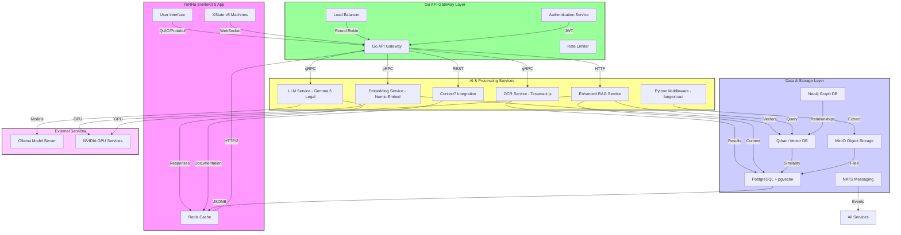
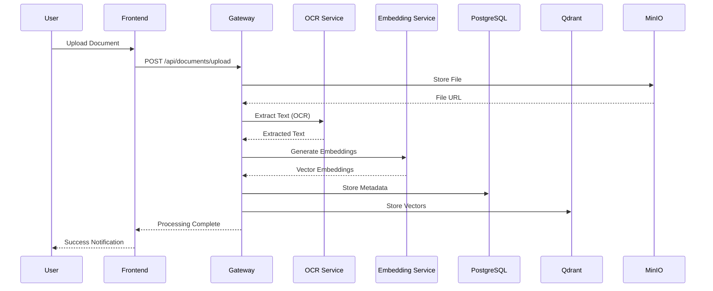
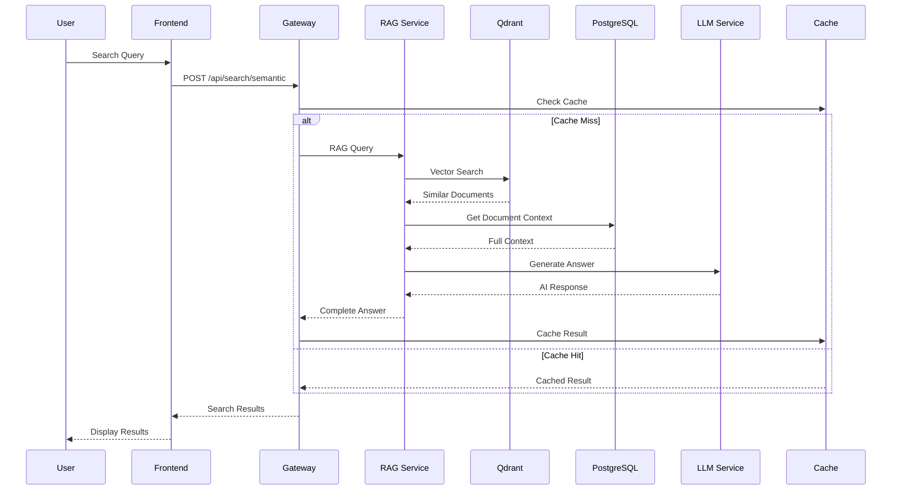

# YoRHa Legal AI System Architecture

## High-Level Architecture
This document outlines the comprehensive system architecture for the YoRHa Legal AI application. The design is a hybrid microservice architecture that leverages specialized services for high performance, low latency, and efficient data processing.

The core flow is:

**Frontend (SvelteKit)  ➡️  Go Microservice Gateway  ➡️  Backend Services**



## Service Specifications

### 1. Frontend Layer - SvelteKit 5 YoRHa App

**Technology Stack:**
- **Framework:** SvelteKit 2.0 + Svelte 5 (Runes)
- **State Management:** XState v5 Machines
- **UI Components:** Custom YoRHa-themed components + Melt UI
- **Communication:** QUIC, WebSocket, HTTP/2
- **Caching:** Browser cache + ServiceWorker

**Core Features:**
- Legal case management interface
- Evidence upload and analysis
- AI chat interface with streaming responses
- Real-time collaboration features
- Advanced search and filtering
- Document visualization and annotation

**State Machines (XState v5):**
```typescript
// Core state machines implemented
- aiAssistantMachine: AI chat and analysis
- enhanced-legal-case-machine: Case lifecycle management
- caseManagementMachine: Case operations
- uploadMachine: File upload processing
- sessionMachine: User session management
```

### 2. Go API Gateway - Central Orchestrator

**Technology Stack:**
- **Language:** Go 1.21+
- **Framework:** Gin + gRPC
- **Protocols:** QUIC, gRPC, HTTP/2, WebSocket
- **Authentication:** JWT + OAuth2
- **Monitoring:** Prometheus + Grafana

**Core Responsibilities:**
- Request routing and load balancing
- Authentication and authorization
- Rate limiting and throttling
- Protocol translation (QUIC ↔ gRPC ↔ HTTP)
- Circuit breaker patterns
- Request/response caching
- Metrics collection and logging

**Service Discovery:**
```go
type ServiceRegistry struct {
    OCRService       string // localhost:8001
    EmbeddingService string // localhost:8002  
    LLMService       string // localhost:8003
    RAGService       string // localhost:8094
    UploadService    string // localhost:8093
}
```

### 3. AI & Processing Services

#### 3.1 OCR Service (Tesseract.js)
**Port:** 8001  
**Technology:** Node.js + Tesseract.js  
**Purpose:** Extract text from images and PDFs

```javascript
// API Contract
POST /ocr/process
{
  "fileUrl": "minio://bucket/file.pdf",
  "language": "eng",
  "outputFormat": "text|hocr|pdf"
}

// Response
{
  "text": "extracted text content",
  "confidence": 95.2,
  "processingTime": 1250,
  "metadata": {
    "pages": 3,
    "language": "eng",
    "dpi": 300
  }
}
```

#### 3.2 Embedding Service (Nomic-Embed)
**Port:** 8002  
**Technology:** Python + HuggingFace Transformers  
**Purpose:** Generate vector embeddings for semantic search

```python
# API Contract
POST /embed/generate
{
  "texts": ["legal document text", "case summary"],
  "model": "nomic-embed-text",
  "dimensions": 768
}

# Response
{
  "embeddings": [[0.1, 0.2, ...], [0.3, 0.4, ...]],
  "dimensions": 768,
  "model": "nomic-embed-text",
  "processingTime": 156
}
```

#### 3.3 LLM Service (Gemma 3 Legal)
**Port:** 8003  
**Technology:** Go + Ollama Integration  
**Purpose:** Legal AI analysis and generation

```go
// API Contract
POST /llm/analyze
{
  "prompt": "analyze this legal document",
  "context": ["document1", "document2"],
  "model": "gemma3-legal",
  "temperature": 0.7,
  "maxTokens": 1000,
  "stream": true
}

// Streaming Response
{
  "id": "req_123",
  "chunk": "Based on the legal analysis...",
  "finished": false,
  "metadata": {
    "tokensUsed": 245,
    "confidence": 0.89
  }
}
```

#### 3.4 Enhanced RAG Service
**Port:** 8094  
**Technology:** Go + Vector Search + LLM  
**Purpose:** Retrieval-Augmented Generation for legal queries

```go
// API Contract
POST /rag/query
{
  "query": "What are the liability implications?",
  "caseId": "case_123",
  "includeContext": true,
  "vectorThreshold": 0.7,
  "maxResults": 10
}

// Response
{
  "answer": "Based on the relevant legal precedents...",
  "sources": [
    {
      "documentId": "doc_456",
      "title": "Contract Law Precedent",
      "relevanceScore": 0.92,
      "excerpt": "relevant text snippet"
    }
  ],
  "confidence": 0.87,
  "processingTime": 890
}
```

### 4. Data & Storage Layer

#### 4.1 PostgreSQL + pgvector
**Port:** 5432  
**Purpose:** Primary relational database with vector search capabilities

**Schema Design:**
```sql
-- Core tables
CREATE TABLE users (
  id UUID PRIMARY KEY DEFAULT gen_random_uuid(),
  email VARCHAR(255) UNIQUE NOT NULL,
  hashed_password VARCHAR(255),
  first_name VARCHAR(100),
  last_name VARCHAR(100),
  role VARCHAR(50) DEFAULT 'user',
  created_at TIMESTAMP DEFAULT NOW()
);

CREATE TABLE cases (
  id UUID PRIMARY KEY DEFAULT gen_random_uuid(),
  title VARCHAR(500) NOT NULL,
  description TEXT,
  status VARCHAR(50) DEFAULT 'open',
  priority VARCHAR(20) DEFAULT 'medium',
  user_id UUID REFERENCES users(id),
  metadata JSONB DEFAULT '{}',
  created_at TIMESTAMP DEFAULT NOW(),
  updated_at TIMESTAMP DEFAULT NOW()
);

CREATE TABLE evidence (
  id UUID PRIMARY KEY DEFAULT gen_random_uuid(),
  title VARCHAR(500) NOT NULL,
  description TEXT,
  evidence_type VARCHAR(100) NOT NULL,
  file_path VARCHAR(1000),
  case_id UUID REFERENCES cases(id),
  user_id UUID REFERENCES users(id),
  metadata JSONB DEFAULT '{}',
  embedding vector(768),  -- pgvector for semantic search
  created_at TIMESTAMP DEFAULT NOW()
);

-- Vector search indexes
CREATE INDEX evidence_embedding_idx ON evidence 
USING hnsw (embedding vector_cosine_ops);
```

#### 4.2 Qdrant Vector Database
**Port:** 6333  
**Purpose:** High-performance vector similarity search

```yaml
# Collection Configuration
collection_name: "legal_documents"
vector_config:
  size: 768
  distance: "Cosine"
  
# Index Configuration
hnsw_config:
  m: 16
  ef_construct: 200
  full_scan_threshold: 10000
```

#### 4.3 MinIO Object Storage
**Port:** 9000  
**Purpose:** S3-compatible object storage for files

```yaml
# Bucket Structure
buckets:
  - legal-documents     # PDF, DOCX files
  - evidence-files      # Images, videos
  - processed-content   # OCR results, embeddings
  - system-backups      # Database backups
```

#### 4.4 Redis Cache
**Port:** 6379  
**Purpose:** High-performance caching and session storage

```redis
# Cache Structure
legal:embeddings:{doc_id}     # Vector embeddings (TTL: 7d)
legal:analysis:{query_hash}   # LLM analysis results (TTL: 1d)
legal:sessions:{user_id}      # User sessions (TTL: 30m)
legal:search:{query_hash}     # Search results (TTL: 1h)
```

#### 4.5 Neo4j Graph Database
**Port:** 7474  
**Purpose:** Legal entity relationships and case connections

```cypher
// Node Types
(:Case {id, title, status, priority})
(:Person {id, name, role, organization})
(:Document {id, title, type, source})
(:Precedent {id, citation, court, date})

// Relationships
(case)-[:HAS_EVIDENCE]->(document)
(case)-[:INVOLVES]->(person)
(case)-[:CITES]->(precedent)
(document)-[:MENTIONS]->(person)
```

## Communication Protocols

### 1. QUIC Protocol (Frontend ↔ Gateway)
**Advantages:**
- Ultra-low latency (0-RTT connection resumption)
- Built-in encryption
- Multiplexed streams
- Better performance over mobile networks

```go
// QUIC Server Configuration
server := &quic.Server{
    Addr:      ":8080",
    Handler:   http.HandlerFunc(handleQUIC),
    TLSConfig: generateTLSConfig(),
}
```

### 2. gRPC (Gateway ↔ AI Services)
**Advantages:**
- High performance binary protocol
- Strong typing with Protocol Buffers
- Built-in load balancing
- Streaming support

```protobuf
// Service Definitions
service LLMService {
  rpc AnalyzeDocument(AnalysisRequest) returns (stream AnalysisResponse);
  rpc GenerateEmbedding(EmbeddingRequest) returns (EmbeddingResponse);
}

service OCRService {
  rpc ProcessDocument(OCRRequest) returns (OCRResponse);
  rpc GetProcessingStatus(StatusRequest) returns (StatusResponse);
}
```

### 3. WebSocket (Real-time Features)
**Use Cases:**
- Live document collaboration
- Real-time AI analysis streaming
- System notifications
- Chat interface updates

```typescript
// WebSocket Event Types
type WSEvent = 
  | { type: 'document_update'; payload: DocumentUpdate }
  | { type: 'ai_response_chunk'; payload: AIChunk }
  | { type: 'case_status_change'; payload: CaseUpdate }
  | { type: 'system_notification'; payload: Notification };
```

## Data Flow Patterns

### 1. Document Processing Pipeline



### 2. AI-Powered Search & Analysis



## Performance Optimization

### 1. Caching Strategy
```yaml
# Multi-layer caching
L1_Cache: Browser (ServiceWorker) - 1MB
L2_Cache: CDN (CloudFlare) - 100MB  
L3_Cache: Redis - 1GB
L4_Cache: Application (In-Memory) - 500MB
```

### 2. Database Optimization
```sql
-- Optimized indexes for common queries
CREATE INDEX CONCURRENTLY idx_cases_user_status 
ON cases(user_id, status) WHERE status = 'open';

CREATE INDEX CONCURRENTLY idx_evidence_case_type 
ON evidence(case_id, evidence_type);

-- Partitioning for large tables
CREATE TABLE evidence_y2024 PARTITION OF evidence 
FOR VALUES FROM ('2024-01-01') TO ('2025-01-01');
```

### 3. Connection Pooling
```go
// Database connection pool
db := &sql.DB{
    MaxOpenConns:    25,
    MaxIdleConns:    5,
    ConnMaxLifetime: 5 * time.Minute,
    ConnMaxIdleTime: 1 * time.Minute,
}

// gRPC connection pool
grpcPool := &grpc.ClientConn{
    MaxReceiveMessageSize: 16 * 1024 * 1024, // 16MB
    MaxSendMessageSize:    16 * 1024 * 1024, // 16MB
    KeepAliveParameters: keepalive.ClientParameters{
        Time:    30 * time.Second,
        Timeout: 5 * time.Second,
    },
}
```

## Security Architecture

### 1. Authentication & Authorization
```yaml
# JWT Token Structure
Header:
  alg: "RS256"
  typ: "JWT"

Payload:
  sub: "user_id"
  iat: 1640995200
  exp: 1641081600
  roles: ["prosecutor", "admin"]
  permissions: ["read:cases", "write:evidence"]
```

### 2. API Security
```go
// Rate limiting configuration
rateLimiter := middleware.RateLimiter{
    RequestsPerSecond: 100,
    BurstSize:         200,
    WindowSize:        time.Minute,
}

// CORS configuration
cors := cors.Config{
    AllowOrigins: []string{
        "https://legal-ai.prosecution.gov",
        "https://staging.legal-ai.prosecution.gov",
    },
    AllowMethods: []string{"GET", "POST", "PUT", "DELETE"},
    AllowHeaders: []string{"Authorization", "Content-Type"},
}
```

### 3. Data Encryption
```yaml
# Encryption at rest
Database: AES-256 (PostgreSQL TDE)
ObjectStorage: AES-256-GCM (MinIO)
Cache: AES-256 (Redis)

# Encryption in transit
API_Gateway: TLS 1.3
Microservices: mTLS (mutual TLS)
Database: SSL/TLS
```

## Monitoring & Observability

### 1. Metrics Collection
```yaml
# Prometheus metrics
Services:
  - http_requests_total{service, endpoint, status}
  - http_request_duration_seconds{service, endpoint}
  - database_connections_active{service, database}
  - vector_search_latency{collection, operation}
  - ai_model_inference_time{model, operation}

Alerts:
  - High error rate (>5% for 5 minutes)
  - High latency (>1s p95 for 5 minutes) 
  - Database connection pool exhaustion
  - Vector database disk usage >80%
```

### 2. Logging Strategy
```json
// Structured logging format
{
  "timestamp": "2024-01-14T13:15:30.123Z",
  "level": "INFO",
  "service": "api-gateway",
  "request_id": "req_123456",
  "user_id": "user_789",
  "operation": "document_upload",
  "duration_ms": 245,
  "metadata": {
    "file_size": 2048576,
    "file_type": "application/pdf"
  }
}
```

### 3. Distributed Tracing
```yaml
# Jaeger tracing configuration
Tracer: "jaeger"
SamplingRate: 0.1  # 10% of requests
Services:
  - api-gateway
  - ocr-service
  - embedding-service
  - llm-service
  - rag-service
```

## Deployment Architecture

### 1. Kubernetes Deployment
```yaml
# Production deployment configuration
apiVersion: apps/v1
kind: Deployment
metadata:
  name: yorha-legal-ai-gateway
spec:
  replicas: 3
  selector:
    matchLabels:
      app: api-gateway
  template:
    spec:
      containers:
      - name: api-gateway
        image: yorha-legal/api-gateway:v1.2.0
        ports:
        - containerPort: 8080
        env:
        - name: DATABASE_URL
          valueFrom:
            secretKeyRef:
              name: postgres-secret
              key: url
        resources:
          requests:
            memory: "512Mi"
            cpu: "500m"
          limits:
            memory: "1Gi"
            cpu: "1000m"
```

### 2. Service Mesh (Istio)
```yaml
# Service mesh configuration
apiVersion: networking.istio.io/v1alpha3
kind: VirtualService
metadata:
  name: yorha-legal-routing
spec:
  hosts:
  - legal-ai.prosecution.gov
  http:
  - match:
    - uri:
        prefix: "/api/v1/ai"
    route:
    - destination:
        host: llm-service
        subset: stable
      weight: 90
    - destination:
        host: llm-service
        subset: canary
      weight: 10
```

### 3. Infrastructure as Code (Terraform)
```hcl
# Infrastructure provisioning
resource "aws_ecs_cluster" "yorha_legal_cluster" {
  name = "yorha-legal-ai"
  
  setting {
    name  = "containerInsights"
    value = "enabled"
  }
}

resource "aws_rds_cluster" "postgres" {
  cluster_identifier = "yorha-legal-postgres"
  engine            = "aurora-postgresql"
  engine_version    = "14.9"
  database_name     = "legal_ai_db"
  
  backup_retention_period = 14
  backup_window          = "03:00-04:00"
  maintenance_window     = "sun:04:00-sun:05:00"
}
```

## Disaster Recovery & Business Continuity

### 1. Backup Strategy
```yaml
# Automated backup configuration
Databases:
  PostgreSQL:
    Full_Backup: Daily @ 2:00 AM UTC
    Incremental: Every 6 hours
    Retention: 30 days
    Geo_Replication: 3 regions
  
  Qdrant:
    Snapshot: Daily @ 3:00 AM UTC
    Retention: 14 days
    
  MinIO:
    Replication: Cross-region (3 copies)
    Versioning: Enabled
    Lifecycle: 90 days
```

### 2. High Availability
```yaml
# HA configuration
Load_Balancer:
  Type: Application Load Balancer
  Health_Check: /health (30s interval)
  Failover_Time: <30 seconds

Database:
  Primary: us-east-1a
  Standby: us-east-1b, us-west-2a
  Auto_Failover: Enabled
  RTO: <2 minutes
  RPO: <15 seconds

Services:
  Min_Replicas: 2
  Max_Replicas: 10
  Auto_Scaling: CPU >70% or Memory >80%
```

## Cost Optimization

### 1. Resource Optimization
```yaml
# Resource allocation by service
Services:
  API_Gateway:     2 vCPU, 4GB RAM    # $120/month
  OCR_Service:     4 vCPU, 8GB RAM    # $240/month
  Embedding:       8 vCPU, 16GB RAM   # $480/month (GPU optional)
  LLM_Service:     16 vCPU, 32GB RAM  # $960/month (GPU required)
  Databases:       db.r5.2xlarge      # $700/month
  Storage:         1TB SSD + 10TB S3  # $300/month
  
Total_Monthly_Cost: ~$2,800 (without GPU)
With_GPU: ~$4,200 (Tesla T4 instances)
```

### 2. Auto-scaling Policies
```yaml
# Cost-aware scaling
Peak_Hours: 8AM-6PM EST
  Min_Instances: 3
  Max_Instances: 10
  
Off_Peak: 6PM-8AM EST
  Min_Instances: 1
  Max_Instances: 5
  
Weekends:
  Min_Instances: 1
  Max_Instances: 3

# Spot instances for non-critical workloads
Batch_Processing: 80% spot instances
Development: 100% spot instances
```

## Future Roadmap

### Phase 1: Core Platform (Q1 2024) ✅
- [x] Basic CRUD operations
- [x] File upload and OCR
- [x] Vector search implementation
- [x] AI chat interface

### Phase 2: Advanced AI Features (Q2 2024)
- [ ] Multi-modal document analysis
- [ ] Legal precedent mining
- [ ] Automated case summarization
- [ ] Predictive analytics

### Phase 3: Enterprise Features (Q3 2024)
- [ ] Multi-tenant architecture
- [ ] Advanced role-based permissions
- [ ] Audit trail and compliance
- [ ] Enterprise SSO integration

### Phase 4: AI Enhancement (Q4 2024)
- [ ] Custom legal model fine-tuning
- [ ] Real-time collaboration features
- [ ] Advanced workflow automation
- [ ] Mobile application

## Technical Specifications Summary

```yaml
# Complete tech stack
Frontend:
  - SvelteKit 2.0 + Svelte 5 (Runes)
  - XState v5 for state management
  - QUIC/HTTP3 for communication
  - WebSocket for real-time features

Backend:
  - Go 1.21+ (API Gateway)
  - Python 3.11+ (AI Services)
  - Node.js 20+ (OCR Service)
  - Protocol Buffers (gRPC)

Databases:
  - PostgreSQL 16+ with pgvector
  - Qdrant 1.7+ (Vector DB)
  - Redis 7+ (Cache)
  - Neo4j 5+ (Graph DB)

AI/ML:
  - Ollama (Model serving)
  - Gemma 3 (Legal fine-tuned)
  - Nomic-Embed-Text (Embeddings)
  - Tesseract.js (OCR)

Infrastructure:
  - Kubernetes 1.28+
  - Istio 1.19+ (Service mesh)
  - Prometheus + Grafana (Monitoring)
  - Jaeger (Distributed tracing)
  - Terraform (Infrastructure as Code)

Security:
  - JWT authentication
  - mTLS between services
  - AES-256 encryption at rest
  - TLS 1.3 in transit
```

This architecture provides a robust, scalable, and secure foundation for the YoRHa Legal AI application, capable of handling enterprise-level workloads while maintaining high performance and availability.